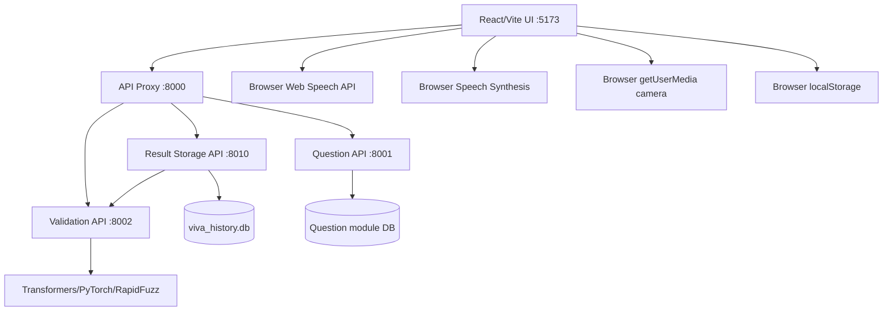
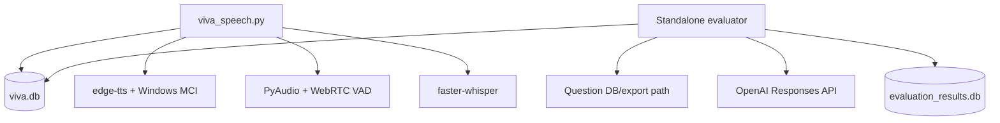
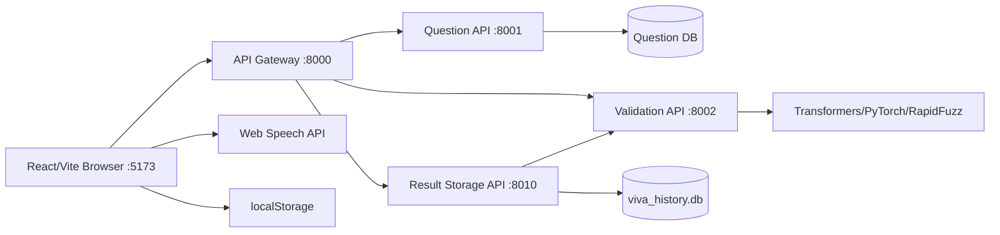
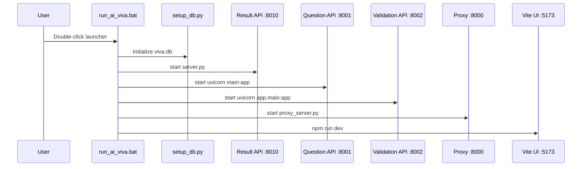
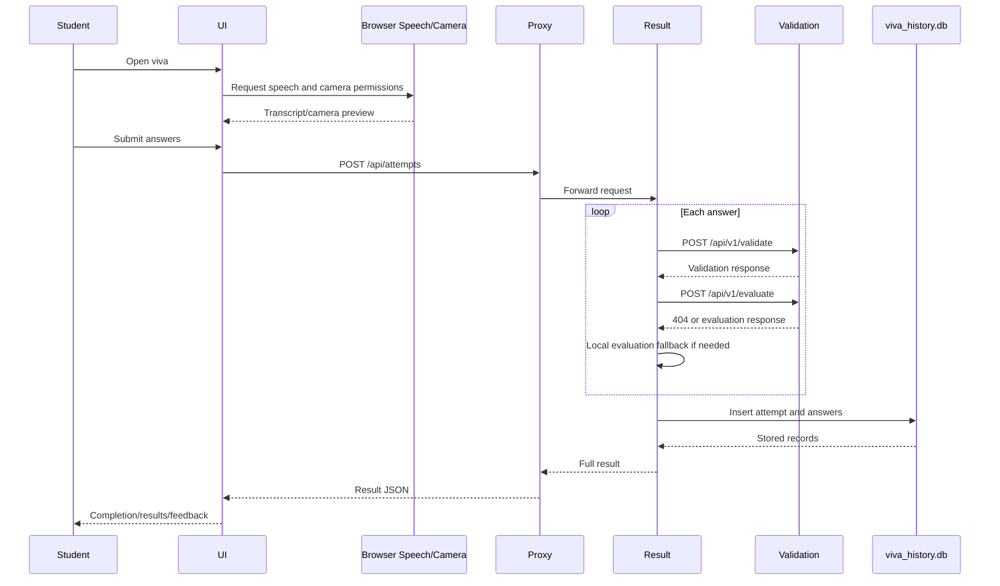
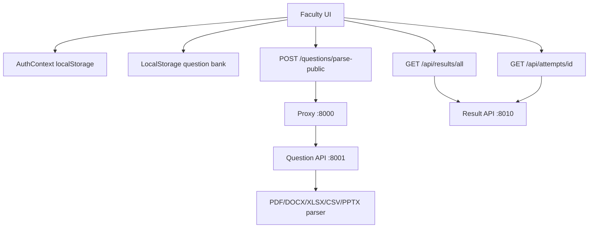
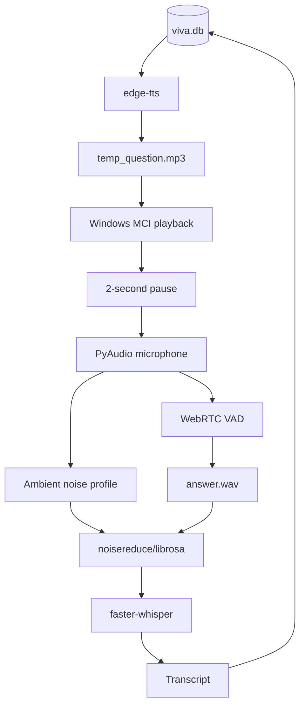
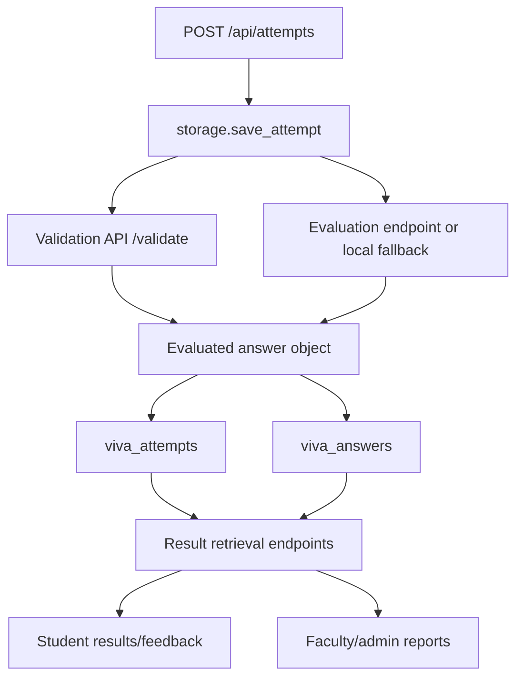
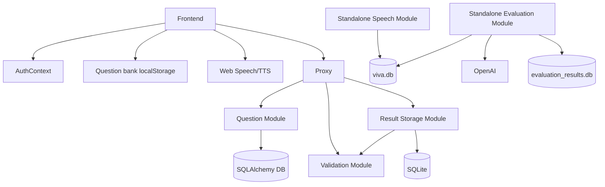

# AI Viva System Project Architecture Report

**Analysis date:** 2026-09-12  
**Scope:** Read-only architectural analysis of the repository and its meaningful source, configuration, startup, test, database, and frontend files.  
**Important:** This report documents the existing implementation. No project code was modified.

## 1. Executive Summary

This repository contains an AI viva system assembled from several independently developed modules:

1. A React/Vite browser application for student, faculty, and admin screens.
2. A result-storage HTTP API that is the main active submission and results backend.
3. A FastAPI question-management service with teacher JWT authentication and file parsing.
4. A FastAPI answer-validation service with local NLP/model paths and optional LLM paths.
5. A standalone Python speech CLI that performs TTS, microphone recording, VAD, noise reduction, Whisper transcription, and SQLite updates.
6. A standalone batch evaluation package using OpenAI and SQLite.
7. A lightweight API proxy that routes frontend requests to the Python services.

The Windows launcher starts five processes: result storage, question API, validation API, proxy, and UI. It does not start the Python speech CLI. The active browser viva therefore does not use the Python speech module. Instead, the browser uses the Web Speech API for live transcription, and the voice-recorder hook only tracks UI state; it does not create or upload an audio recording.

The active end-to-end path is:

```text
React UI
  -> API proxy :8000
  -> Result Storage API :8010
  -> Validation API :8002 for /validate and attempted /evaluate calls
  -> SQLite result database
```

Questions used by the active viva are normally loaded from browser localStorage. The backend `/api/questions` endpoint contains a separate five-question demo bank and is used only when no local question bank is available. Faculty question management also primarily writes to localStorage. The real Question API on port 8001 is mainly used by file-upload flows.

The architecture is therefore a partially integrated system rather than one consistent microservice pipeline. The most important risks are missing backend authorization, mock frontend authentication, duplicated question/evaluation/storage paths, a likely missing `/api/v1/evaluate` endpoint, and a mismatch between advertised browser proctoring/audio capture and the actual implementation.

## 2. Technology Stack

| Area | Technologies actually present | Notes |
|---|---|---|
| Frontend | React, TypeScript, Vite, React Router, Tailwind CSS, Framer Motion, Recharts, Radix UI, Lucide | UI package uses React 19 despite README wording that says React 18. |
| Frontend state/storage | React state, Context API, browser localStorage | Authentication, question bank, active monitoring, flags, selected attempts, and exam settings use localStorage. |
| Frontend speech | Browser Web Speech API / `SpeechRecognition` or `webkitSpeechRecognition`; browser `speechSynthesis` through the speech-question hook | Recognition is continuous and English-only. |
| Frontend camera | `navigator.mediaDevices.getUserMedia({ video: true })` | Camera is displayed locally; no video upload or backend streaming is implemented. |
| Backend HTTP | FastAPI/Uvicorn, Python `http.server`, `httpx` proxy | Three active backend services plus the proxy. |
| Question persistence | SQLAlchemy with SQLite or another configured SQLAlchemy database | `DATABASE_URL` is required by the question module. The launcher creates a SQLite `.env`. |
| Result persistence | SQLite through Python standard library | `result_storage_module/viva_history.db`. |
| Speech persistence | SQLite through Python standard library | Standalone speech module uses `viva.db`. |
| Validation/NLP | Hugging Face Transformers, PyTorch, NumPy, RapidFuzz, regex; optional Gemini; lightweight token-overlap fallback | Heavy model service can load multiple local models lazily. |
| Standalone evaluation | OpenAI Responses API | Uses `OPENAI_API_KEY` and `OPENAI_MODEL`; not launched by the provided startup scripts. |
| Speech CLI | edge-tts, Windows MCI, PyAudio, WebRTC VAD, noisereduce, soundfile, librosa, faster-whisper | Local/CLI path; no HTTP speech server. |
| File parsing | pdfplumber, python-docx, openpyxl, csv, python-pptx | Implemented in the Question API. |
| Package managers | npm for UI; pip/`requirements.txt` for Python services | The Windows launcher may run `npm install`; the macOS/Linux launcher may install Python requirements. |
| Python assumptions | Python 3.9+ in root README; validation README says Python 3.12+; actual code uses modern typing and Pydantic v2 | There is no single enforced Python version. |
| Node assumptions | README says Node.js 18+ | `package.json` does not specify an engines field. |

## 3. Project Folder Map

### Important inventory

| Path | Module | Purpose | Used By | Importance |
|---|---|---|---|---|
| `Instruction.txt` | Documentation | Defines the required architecture-analysis scope and report sections | Architect/maintainer | CRITICAL |
| `README.md` | Documentation | Describes advertised architecture, ports, setup, and product features | Developers | IMPORTANT |
| `INTEGRATED_DEMO.md` | Documentation | Describes the integrated demo path centered on result storage | Developers | IMPORTANT |
| `run_ai_viva.bat` | Startup | Windows launcher; creates service windows and starts the active stack | Windows users | CRITICAL |
| `run_ai_viva_mac.sh` | Startup | macOS/Linux launcher with background processes and logs | Unix users | IMPORTANT |
| `proxy_server.py` | API / Backend | Wildcard proxy on port 8000 | UI and backend services | CRITICAL |
| `result_storage_module/server.py` | Result API | HTTP server on port 8010 | Proxy/UI | CRITICAL |
| `result_storage_module/storage.py` | Result/Database | Questions, validation/evaluation calls, scoring, SQLite persistence, result formatting | Result API | CRITICAL |
| `result_storage_module/viva_history.db` | Result/Database | Persisted viva attempts and answers | Result API | CRITICAL |
| `ai_viva_question_module-main/.../main.py` | Question API | FastAPI teacher auth, question-set CRUD subset, file parsing | Proxy, upload UI | IMPORTANT |
| `ai_viva_question_module-main/.../database.py` | Question/Database | SQLAlchemy settings, models, schemas, DB session | Question API | CRITICAL |
| `ai_viva_question_module-main/.../question_module.db` | Question/Database | Local question-module SQLite database if configured/created | Question API | IMPORTANT |
| `Validation-Module_AI-Viva-main/.../app/main.py` | Validation API | FastAPI application and routes | Proxy/result storage | CRITICAL |
| `.../app/api/v1/validation.py` | Validation API | `POST /api/v1/validate` handler | Validation API | CRITICAL |
| `.../app/services/validation_service.py` | Validation/NLP | Heavy semantic validation and optional model paths | Validation API | IMPORTANT |
| `.../app/services/lightweight_validation_service.py` | Validation/NLP | Dependency-light token-overlap fallback | Validation API fallback | IMPORTANT |
| `.../app/services/rag_service.py` | Validation/NLP | In-memory reference-answer retrieval when expected answer is absent | Heavy validation service | OPTIONAL |
| `.../app/utils/text_processor.py` | Validation/NLP | Text cleaning, fillers, concepts, transcript-quality heuristics | Heavy validation service | IMPORTANT |
| `Validation-Module_AI-Viva-main/.../tests/` | Tests | Validation API, service, model, and text-processing tests | Developers/CI | IMPORTANT |
| `AI_viva_evalution_module-main/.../main.py` | Standalone evaluation | Batch-loads speech answers, evaluates, stores results | Manual batch execution only | POSSIBLY UNUSED |
| `AI_viva_evalution_module-main/.../evaluator.py` | Standalone evaluation | OpenAI-based answer scoring | Standalone evaluator | POSSIBLY UNUSED |
| `AI_viva_evalution_module-main/.../database.py` | Standalone evaluation | `evaluation_results` SQLite schema and writes | Standalone evaluator | POSSIBLY UNUSED |
| `AI_viva_evalution_module-main/.../question_bank.py` | Standalone evaluation | Loads expected answers from an external/stale path or configured database | Standalone evaluator | POSSIBLY UNUSED |
| `Viva-speech-Module-main/.../viva_speech.py` | Speech CLI | TTS, microphone capture, VAD, noise reduction, Whisper, DB update | Manual CLI | IMPORTANT but disconnected |
| `Viva-speech-Module-main/.../record_answer.py` | Speech utility | Simpler standalone microphone/VAD recorder | Manual testing | OPTIONAL |
| `Viva-speech-Module-main/.../transcribe_answer.py` | Speech utility | Standalone faster-Whisper transcription | Manual testing | OPTIONAL |
| `Viva-speech-Module-main/.../speak_question.py` | Speech utility | Standalone Edge TTS question playback | Manual testing | OPTIONAL |
| `Viva-speech-Module-main/.../setup_db.py` | Speech/Database | Creates `viva.db`, table, and five dummy questions | Launcher/manual speech setup | IMPORTANT |
| `Viva-speech-Module-main/.../manage_db.py` | Speech/Database | CLI view/reset/add question utility | Manual speech maintenance | OPTIONAL |
| `Viva_UI_Module-main/.../src/App.tsx` | Frontend | Route tree for student/faculty/admin portals | Browser | CRITICAL |
| `Viva_UI_Module-main/.../src/services/api.ts` | Frontend/API client | Proxy-based question, attempt, result, feedback requests | Frontend pages | CRITICAL |
| `Viva_UI_Module-main/.../src/services/questionBank.ts` | Frontend/Question | LocalStorage question bank and session grouping | Faculty/student UI | CRITICAL for active viva |
| `Viva_UI_Module-main/.../src/contexts/AuthContext.tsx` | Frontend/Auth | LocalStorage-only mock user/session/auth state | All portal layouts | CRITICAL for current UI behavior |
| `Viva_UI_Module-main/.../src/pages/student/VivaExamination.tsx` | Frontend/Student | Active exam screen, question selection, speech recognition, camera, submit | Student | CRITICAL |
| `Viva_UI_Module-main/.../src/hooks/useSpeechRecognition.ts` | Frontend/Speech | Browser live transcript hook | Student viva | CRITICAL |
| `Viva_UI_Module-main/.../src/hooks/useVoiceRecorder.ts` | Frontend/Speech | Recording state simulation | Student viva | IMPORTANT but incomplete |
| `Viva_UI_Module-main/.../src/pages/faculty/QuestionBank.tsx` | Frontend/Faculty | Local question CRUD and public file parse | Faculty | IMPORTANT |
| `Viva_UI_Module-main/.../src/pages/faculty/ReportsPage.tsx` | Frontend/Faculty | Reads attempts, views details, simulates downloads/generation | Faculty | IMPORTANT |
| `Viva_UI_Module-main/.../src/pages/faculty/LiveMonitoring.tsx` | Frontend/Faculty | Reads active session and flags from localStorage | Faculty/student same browser context | IMPORTANT but local-only |
| `Viva_UI_Module-main/package.json` | Frontend/Configuration | UI dependencies and npm scripts | npm | CRITICAL |

Generated assets, Vite/React starter assets, package lock files, `__pycache__`, `.git`, and IDE/build/cache artifacts are not treated as architectural components.

## 4. Startup Architecture

### Windows launcher: `run_ai_viva.bat`

The Windows script:

1. Sets root-relative directories for result storage, UI, question, validation, speech, and `.run_logs`.
2. Checks for the result API, UI package, Python, and npm.
3. Runs `npm install` if UI `node_modules` is missing. This is the only installation step in the Windows launcher.
4. Runs `setup_db.py` in the speech directory and writes output to `.run_logs/speech_setup.log`.
5. Creates a Question-module `.env` if absent:
   - `DATABASE_URL=sqlite:///./question_module.db`
   - `SECRET_KEY=ai-viva-local-dev-secret`
   - `ALGORITHM=HS256`
   - `ACCESS_TOKEN_EXPIRE_MINUTES=60`
6. Creates a Validation-module `.env` if absent, including model names and an empty `GEMINI_API_KEY`.
7. Opens a separate window for `python server.py` in the result-storage directory.
8. Opens a separate window for the Question API using Uvicorn on `127.0.0.1:8001`.
9. Opens a separate `cmd /k` window for the Validation API using Uvicorn on `127.0.0.1:8002`.
10. Opens a proxy window running `python proxy_server.py` from the repository root.
11. Opens a UI window running Vite on `127.0.0.1:5173`.
12. Prints the proxy/UI URLs and pauses the launcher window.

The script does not wait for health checks, does not enforce service readiness ordering, and does not automatically restart failed services. `start` reports that a process was launched, not that its server became healthy.

### Unix launcher: `run_ai_viva_mac.sh`

The Unix script performs broadly the same setup but:

- Installs every Python requirements file only through the defined `ensure_python_deps` function, although that function is not called in the visible startup sequence.
- Initializes speech DB.
- Installs UI dependencies if needed.
- Creates Question and Validation `.env` files if absent.
- Starts services in the background with logs and PID files under `.run_logs`.
- Attempts cleanup of PIDs from previous runs.
- Keeps the launcher alive in an infinite sleep loop and kills recorded PIDs on `INT`/`TERM`.

It also does not start `viva_speech.py` as an active process.

### Terminal/process table

| Terminal / Process | Started By | Command | Service | Port | Depends On |
|---|---|---|---|---:|---|
| Result API window | `run_ai_viva.bat` | `python server.py` in `result_storage_module` | Result storage/evaluation controller | 8010 | Python, SQLite, validation optionally |
| Question API window | `run_ai_viva.bat` | `python -m uvicorn main:app --host 127.0.0.1 --port 8001` | Question sets/auth/file parser | 8001 | Python, Question `.env`, SQLAlchemy DB |
| Validation API window | `run_ai_viva.bat` | `python -m uvicorn app.main:app --host 127.0.0.1 --port 8002` | Answer validation | 8002 | Python, model packages/config, possibly downloaded models |
| Proxy window | `run_ai_viva.bat` | `python proxy_server.py` | API gateway | 8000 | Python, `httpx` |
| UI window | `run_ai_viva.bat` | `npm.cmd run dev -- --host 127.0.0.1 --port 5173` | React/Vite frontend | 5173 | Node/npm, installed UI dependencies |
| Speech setup command | `run_ai_viva.bat` | `python setup_db.py` | Speech DB initialization only | None | Python, filesystem |
| Speech CLI, if manually run | User, not launcher | `python viva_speech.py` | TTS/record/STT CLI | None | Microphone, Windows MCI, local files/models, `viva.db` |

### Simple startup sequence

```text
Double-click run_ai_viva.bat
  -> validate Python/npm and folders
  -> optionally npm install UI dependencies
  -> initialize speech viva.db
  -> create local Question/Validation .env files
  -> open Result API window on 8010
  -> open Question API window on 8001
  -> open Validation API window on 8002
  -> open Proxy window on 8000
  -> open UI window on 5173
  -> keep launcher paused
```

## 5. Running Services and Ports

| Service | Entry file | Framework | Host | Port | Called by | Calls |
|---|---|---|---|---:|---|---|
| UI | `Viva_UI_Module-main/.../src/main.tsx` via Vite | React/Vite | `127.0.0.1` | 5173 | Browser/user | Proxy, Question API through proxy, browser APIs |
| API Gateway | `proxy_server.py` | FastAPI/Uvicorn + httpx | `127.0.0.1` | 8000 | UI | 8001, 8002, 8010 |
| Question API | `ai_viva_question_module-main/.../main.py` | FastAPI/Uvicorn | `127.0.0.1` | 8001 | Proxy and upload UI | SQLAlchemy database |
| Validation API | `Validation-Module_AI-Viva-main/.../app/main.py` | FastAPI/Uvicorn | `127.0.0.1` | 8002 | Proxy and result storage direct HTTP | NLP/model services |
| Result Storage API | `result_storage_module/server.py` | Python `ThreadingHTTPServer` | `127.0.0.1` | 8010 | Proxy/UI | SQLite and direct validation HTTP |
| Speech CLI | `Viva-speech-Module-main/.../viva_speech.py` | Python CLI, no web framework | Local process | None | Manual user | `viva.db`, microphone, TTS/STT |
| Standalone evaluation | `AI_viva_evalution_module-main/.../main.py` | Python CLI | Local process | None | Manual user only | OpenAI, SQLite, speech/question databases |

### Routing rules in `proxy_server.py`

- `api/v1/validation...` and `api/v1/validate...` -> port 8002.
- `questions`, `auth/register`, `auth/login`, `auth/token`, `auth/me` -> port 8001.
- `api/questions`, `api/results`, `api/feedback`, `api/attempts`, `api/health` -> port 8010.
- Any other path -> proxy 404.

The proxy uses wildcard CORS and forwards request headers/body, excluding only `host`. It creates one global `httpx.AsyncClient` and does not visibly close it during application shutdown.

## 6. Frontend-to-Backend Communication

### Main endpoint mapping

| Endpoint | Method | Called from | Backend handler | Purpose | Input | Output |
|---|---|---|---|---|---|---|
| `/api/questions` | GET | `fetchQuestions()` fallback in `VivaExamination.tsx` | `VivaApiHandler.do_GET` -> `public_questions()` | Return five backend demo questions | None | `{questions: [...]}` |
| `/api/attempts` | POST | `submitAttempt()` from `VivaExamination.tsx` | `VivaApiHandler.do_POST` -> `save_attempt()` | Validate/evaluate and persist a viva attempt | Student identity, subject, duration, answers | `{result: full attempt}` |
| `/api/results/latest` | GET | Result/admin pages | `get_latest_attempt()` | Return newest attempt globally | None | `{result: ...}` |
| `/api/results/student/<id>` | GET | API client; not the preferred detailed UI path | `get_student_latest_attempt()` | Return newest attempt for supplied ID | URL student ID | `{result: ...}` or null |
| `/api/attempts/student/<id>` | GET | Student dashboard/results/feedback | `get_student_attempts()` | Return attempt summaries for supplied ID | URL student ID | `{attempts: [...]}` |
| `/api/attempts/<id>` | GET | Result, feedback, reports, admin detail | `get_attempt_by_id()` | Return full attempt and answer details | URL attempt ID | `{result: ...}` or 404 |
| `/api/results/all` | GET | Faculty/admin dashboards/reports | `get_all_attempts()` | Return summary of all attempts | None | `{attempts: [...]}` |
| `/api/feedback/latest` | GET | API client | Latest attempt feedback | None | `{feedback: ...}` |
| `/api/health` | GET | Manual/demo verification | Health branch in result API | Verify result service | None | `{status: "ok", module: ...}` |
| `/api/v1/validate` | POST | Result storage direct HTTP; validation tests | `validate_student_answer()` | Validate transcript relevance/quality | Question, expected answer, student answer, language, metadata | Validation status/scores/remarks |
| `/api/v1/evaluate` | POST | Result storage direct HTTP | No matching route was found in inspected validation API | Intended answer evaluation endpoint | Same conceptual answer payload | Expected evaluation object, but likely 404/fallback |
| `/auth/register` | POST | `AdminPdfUpload.tsx` | Question API `register()` | Create teacher record | Name/email/password | Teacher record |
| `/auth/login` | POST | `AdminPdfUpload.tsx` | Question API `login()` | Obtain teacher JWT | Email/password | Bearer token |
| `/questions/upload` | POST | `AdminPdfUpload.tsx` | Question API `upload_file()` | Authenticated persistent question-set upload | Multipart file/title/subject + JWT | Question set with answers |
| `/questions/parse-public` | POST | Faculty `QuestionBank.tsx` | Question API `parse_file_public()` | Parse file without storing it in Question DB | Multipart file/title/subject | Parsed Q&A list |
| `/questions/my-sets` | GET | No confirmed UI caller found | Question API | List teacher-owned sets | JWT | Question-set summaries |
| `/questions/set/{id}/teacher` | GET | No confirmed UI caller found | Question API | Teacher view including answers | JWT | Question set + answers |
| `/questions/set/{id}/viva` | GET | No confirmed UI caller found | Question API | Viva view without answers | JWT | Question set without answers |
| `/questions/set/{id}/answers` | GET | No confirmed UI caller found | Question API | Answer map for evaluation | JWT | Expected-answer map |
| `/questions/set/{id}` | DELETE | No confirmed UI caller found | Question API | Delete teacher-owned set | JWT | 204 |

### Active submission path

```text
VivaExamination.tsx
  -> submitAttempt()
  -> proxy :8000/api/attempts
  -> result_storage_module/server.py
  -> storage.save_attempt()
  -> validate_answer() -> :8002/api/v1/validate, or local fallback
  -> evaluate_answer() -> :8002/api/v1/evaluate, or local fallback
  -> SQLite viva_history.db
  -> formatted result returned to UI
```

The frontend sends `questionText`, `category`, and sometimes `expectedAnswer`. For local question-bank questions, the expected answer is sent. For backend demo questions, `expectedAnswer` is omitted and `save_attempt()` uses the question text as the expected answer rather than retrieving the backend demo answer, which is a scoring inconsistency.

### Backend APIs with no confirmed active caller

The Question API CRUD/read routes, `/api/results/student/<id>`, `/api/feedback/latest`, and most authentication routes are either used indirectly/conditionally or have no confirmed normal UI path. The standalone evaluation API does not exist as an HTTP service in the inspected code.

## 7. Teacher Workflow

### Faculty login and authorization

The normal Faculty login page calls `AuthContext.login()`, which searches localStorage and otherwise creates/uses a default faculty user. It does not call `/auth/login` on the Question API. The department field is required in the form but is not used to authenticate or authorize the user.

The Question API itself has real teacher registration/login JWT functions, but the UI uses that backend authentication only in the separate admin PDF upload path, where it registers/logs in a teacher using credentials held in the upload component.

### Question creation/edit/delete

The primary faculty Question Bank flow is local:

```text
Faculty QuestionBank.tsx
  -> getBankQuestions()
  -> browser localStorage key viva_question_bank
  -> create/edit/delete in React state
  -> saveBankQuestions()
  -> localStorage
```

Questions contain local fields such as ID, question, answer, subject, category, difficulty, language, status, time limit, creator, date, and use count. There is no backend persistence for normal create/edit/delete actions.

### File import

Faculty file import uses:

```text
QuestionBank.tsx
  -> POST http://127.0.0.1:8000/questions/parse-public
  -> proxy routes to Question API :8001
  -> parse_file_public()
  -> pdfplumber/python-docx/openpyxl/csv/python-pptx parser
  -> parsed Q&A returned
  -> frontend converts results to BankQuestion objects
  -> localStorage
```

This public parser does not store the question set in the Question API database. It requires supported file types and a maximum size of 5 MB, but the public endpoint does not enforce the 10-15 question count restriction used by authenticated upload.

### Admin upload

The admin upload component follows a different path:

```text
AdminPdfUpload.tsx
  -> POST /auth/register using hardcoded/default teacher credentials
  -> POST /auth/login
  -> POST /questions/upload with Bearer token
  -> Question API database
```

This stores a persistent question set owned by a teacher. It does not automatically synchronize the resulting set into the frontend localStorage bank.

### Selecting a set for students

There is no confirmed backend exam-assignment workflow. The faculty dashboard groups localStorage questions by subject and the student dashboard derives available sessions from the same localStorage bank. A student selecting a session writes `selected_viva_subject` and `selected_viva_title` to localStorage.

### Faculty viewing results

Faculty dashboards and reports call `/api/results/all`, then use `/api/attempts/{id}` for detailed reports. They can view summary attempts and individual stored answer details. The report download currently creates a text blob with a `.txt` filename; it does not generate a real PDF. Custom report generation creates simulated in-memory records with fixed values rather than persisting or exporting a real report.

### Faculty live monitoring

Live monitoring is same-browser/localStorage coordination:

```text
Student VivaExamination.tsx
  -> writes viva_active_session every second
  -> Faculty LiveMonitoring.tsx reads it every 1.5 seconds
  -> faculty flag writes viva_suspicious_flag
  -> student viva polls that key every 1.5 seconds
```

No server, WebSocket, video transport, telemetry API, or cross-device synchronization is implemented.

### Not implemented or only simulated

- Backend-backed faculty question CRUD from the normal faculty UI: not implemented.
- Exam assignment/scheduling through the backend: not implemented.
- Persistent real-time monitoring: not implemented.
- Real PDF/XLSX report generation: not implemented.
- Backend faculty authorization for result viewing: not implemented.

## 8. Student Workflow

```text
Browser opens React route
  -> AuthContext initializes a default/localStorage user
  -> StudentDashboard reads student attempts from /api/attempts/student/{id}
  -> local question-bank sessions are shown
  -> student selects a session
  -> localStorage stores selected subject/title
  -> VivaInstructions checks local settings/attempts
  -> VivaExamination loads localStorage questions first
  -> browser speech synthesis reads question
  -> browser Web Speech API transcribes answer
  -> camera preview is opened locally
  -> answers are submitted through /api/attempts
  -> result API validates/evaluates and stores SQLite records
  -> completion page navigates to results/feedback
  -> result pages retrieve stored attempts
```

### Stage details

| Stage | Implementation | Storage/output |
|---|---|---|
| Identification/login | `AuthContext` localStorage mock; no backend student auth | `viva_session_student`, `viva_session`, `viva_users` |
| Viva selection | `getUpcomingSessionsFromBank()` | `selected_viva_subject`, `selected_viva_title` |
| Question loading | Local bank first; backend `/api/questions` fallback; built-in `demoQuestions` fallback | React state |
| Question display | `VivaExamination.tsx` | React state |
| Question speech | `useSpeechQuestion.ts`, browser speech synthesis | Browser audio only |
| Answer capture | `useSpeechRecognition.ts` Web Speech API; optional typed textarea | React state/localStorage only until submit |
| Audio recording | `useVoiceRecorder.ts` state transitions only | No audio file or upload |
| Camera | Browser `getUserMedia` video preview | No persistent recording or upload |
| Validation | Result API calls validation service synchronously per answer | Validation object in answer record |
| Evaluation | Result API calls attempted `/evaluate`, then local fallback if unavailable | Score/verdict/feedback in answer record |
| Result storage | `viva_attempts`, `viva_answers` | `viva_history.db` |
| Result display | Student results/feedback pages call attempts/detail endpoints | React charts/cards |

The browser submission is synchronous from the user’s perspective: the POST does not return until all questions have been processed and inserted. Individual validation/evaluation calls have a three-second timeout in the result storage code.

## 9. Speech Workflow

There are two separate speech workflows.

### Active browser workflow

```text
Student microphone permission
  -> Web Speech API SpeechRecognition
  -> continuous interim/final transcript
  -> React answers state
  -> optional manually edited textarea
  -> JSON POST to result API
```

Confirmed behavior:

- Recognition uses `SpeechRecognition` or `webkitSpeechRecognition`.
- `continuous = true`, `interimResults = true`, `maxAlternatives = 1`.
- Language is hardcoded to `en-US`.
- Final transcript segments are appended to state; interim text is displayed separately.
- Errors set listening false and log a warning.
- No confidence score is read or forwarded.
- No browser `MediaRecorder` is used.
- `useVoiceRecorder` does not capture audio; comments explicitly describe a future real implementation.
- No audio is uploaded over HTTP.
- No backend speech server is involved.

Question playback uses the browser speech-question hook, not the Python TTS module.

### Standalone Python workflow

```text
viva.db.viva_questions.question_text
  -> edge_tts.Communicate
  -> temp_question.mp3
  -> Windows MCI playback
  -> 2-second pause
  -> PyAudio microphone, 16 kHz mono PCM
  -> 0.5-second ambient noise capture
  -> WebRTC VAD
  -> answer.wav
  -> soundfile/librosa/noisereduce processing
  -> faster-whisper small model, CPU/int8, English
  -> transcript with low-log-prob segments replaced by [unclear]
  -> delete answer.wav
  -> update viva_questions.viva_answers
```

`viva_speech.py` uses a 30-second hard cap, an 8-second silence timeout, VAD mode 1, and one microphone reconnection attempt. If no transcript is produced it writes `[No response]`. Temporary MP3 and WAV files are intended to be deleted, but cleanup can fail and is only logged.

The separate `record_answer.py` utility uses different values: VAD mode 2, 32-second cap, 5-second silence timeout, and no noise reduction. This is a standalone alternative, not the main pipeline.

### Speech conclusions

- The Python speech module is not started by either launcher as an ongoing service.
- It has no HTTP endpoint and cannot directly serve the React UI.
- It uses a separate database from the active result API.
- The frontend and Python speech module are not connected by code.

## 10. Question Workflow

### Active frontend question source priority

`VivaExamination.tsx` uses this priority:

1. Active questions from `localStorage` key `viva_question_bank`.
2. `GET /api/questions` from result storage if the local bank is empty.
3. In-memory `demoQuestions` if loading fails or no result is returned.

The local bank is initialized with five Data Structures & Algorithms questions. Faculty local CRUD and file import append to this bank. Questions are grouped by subject to form student sessions. There is no randomization in the inspected active path. The bank assigns sequential numeric IDs when mapping to the viva UI.

### Backend Question API source

The Question API stores:

- `teachers`
- `question_sets`
- `questions`

A question set belongs to one teacher and cascades deletion to its questions. Authenticated file upload accepts 10-15 Q&A pairs and supports PDF, DOCX, XLSX, CSV, and PPTX. It can expose a teacher view with answers, a viva view without answers, and an answer map for evaluation.

### Result API demo questions

`result_storage_module/storage.py` contains five hardcoded `DEMO_QUESTIONS`. `/api/questions` returns public versions with expected keywords and sample transcripts. When the frontend submits these questions, it does not include `expectedAnswer`; the result API then uses `questionText` as a fallback expected answer, rather than the corresponding demo answer. This makes backend-demo scoring differ from local-bank scoring.

### Standalone speech question source

`setup_db.py` creates five different questions in `viva.db`. `viva_speech.py` selects unanswered rows ordered by ID. This database is independent of the Question API and result API question banks.

### Duplicate prevention and selection

- Speech DB initialization avoids inserting its dummy questions when rows already exist.
- LocalStorage bank ensures the default five questions are present.
- No general duplicate-question prevention is implemented for faculty local creation/import.
- No server-side exam assignment or question-set synchronization is confirmed.

## 11. Validation Workflow

Validation means answer/transcript quality and semantic relevance, not identity validation or cheating detection.

### Entry point

```text
result_storage_module/storage.py
  -> validate_answer()
  -> POST http://127.0.0.1:8002/api/v1/validate
  -> validation.py validate_student_answer()
  -> ValidationService or lightweight fallback
```

The request contains question, expected answer, student answer, language, and optional speech metadata.

### Heavy validation path

When the heavy `ValidationService` imports successfully, it can:

1. Retrieve an expected answer through in-memory RAG if one is absent.
2. Optionally translate non-English input.
3. Optionally use Gemini when `use_llm` metadata is true and `GEMINI_API_KEY` exists.
4. Optionally use a local QA LLM when `use_local_llm` is true.
5. Clean text and remove fillers.
6. Reject empty, too-short, repetitive, or gibberish transcripts.
7. Generate embeddings for student, expected answer, and question.
8. Calculate cosine similarities.
9. Blend expected-answer similarity and question similarity:

$$
relevance = 0.65 \times semantic\_similarity + 0.35 \times question\_similarity
$$

10. Extract expected concepts and compare them using exact/fuzzy matching.
11. Mark completeness as Complete at coverage `>= 0.60`, Partially Complete at `>= 0.30`, otherwise Irrelevant.
12. Run zero-shot NLI classification.
13. Mark the answer invalid if completeness is Irrelevant or NLI rejects it.
14. Calculate confidence:

$$
confidence = 0.3 \times quality\_score + 0.7 \times semantic\_similarity
$$

### Lightweight fallback

The fallback removes common stop words, requires at least three meaningful answer tokens, computes set overlap with expected tokens, and uses thresholds:

- Similarity `>= 0.60`: Valid/Complete.
- Similarity `>= 0.25`: Valid/Partially Complete.
- Otherwise: Invalid/Irrelevant.

It returns relevance as `min(1.0, similarity + 0.15)` and confidence as the mean of relevance and similarity.

### Validation failure behavior

If the validation service is unavailable, the result API catches `URLError`, timeout, or JSON decoding errors and uses a local token-overlap validator. If model loading fails inside the validation API, the global exception handler returns HTTP 500; the result API then falls back only if its HTTP request fails in a caught way.

The validation module does not receive raw audio. It receives text transcripts.

## 12. Evaluation Workflow

There are two evaluation designs.

### Active result-storage evaluation

For every non-empty submitted answer, `save_attempt()` calls:

1. `validate_answer()` against the validation API.
2. `evaluate_answer()` against `http://127.0.0.1:8002/api/v1/evaluate`.
3. If the evaluation request fails, `local_evaluate_answer()`.

The inspected Validation API registers only `/api/v1/validate`; no `/api/v1/evaluate` handler was found. Therefore the active system is expected to use the local fallback unless another route exists outside the inspected files.

The local evaluation algorithm:

- Tokenizes expected and student text.
- Removes a small stop-word list.
- Computes expected-term coverage.
- Coverage `>= 0.70` -> score 8.
- Coverage `>= 0.40` -> score 6.
- Coverage below 0.40 but at least five student words -> score 5.
- Otherwise -> score 3.
- Empty answer -> score 0.
- Verdict: score `>= 8` Correct, `>= 5` Partially Correct, otherwise Incorrect.

There is also a post-processing rule: any non-empty answer with at least two words is raised to at least 5 points, up to a word-count-derived value. This can increase a semantically poor answer after the evaluator returns.

Total result scoring is:

$$
percentage = \frac{total\_score}{number\_of\_questions \times 10} \times 100
$$

Grade thresholds:

- `>= 90`: A+
- `>= 80`: A
- `>= 70`: B+
- `>= 60`: B
- `>= 50`: C
- otherwise: Needs Review

The five displayed metrics are derived heuristically from the overall percentage, not independently measured communication, accuracy, fluency, depth, or concept understanding.

### Standalone OpenAI evaluation

The separate evaluation package sends each transcript to an OpenAI Responses API model using a JSON-only examiner prompt. It expects a score 0-10, verdict, strengths, missing points, and feedback, then stores rows in `evaluation_results.db`. It is manually run by `AI_viva_evalution_module-main/.../main.py`, is not launched by the root scripts, and uses database paths that do not match the active modules by default.

### Evaluation concerns

- The active `/evaluate` route appears absent.
- OpenAI evaluation and local evaluation are separate, competing designs.
- There is no explicit retry around model/API evaluation beyond the local fallback.
- The active score is not a transparent semantic-quality score when the fallback/post-processing rules apply.
- The UI claims five independent metrics, but the backend derives them from one percentage.

## 13. Database and Storage

### Result database: `result_storage_module/viva_history.db`

Created by `storage.init_db()`.

#### `viva_attempts`

| Column | Meaning |
|---|---|
| `id` | Integer primary key/autoincrement |
| `student_id` | Candidate identifier supplied by client |
| `student_name` | Candidate name supplied by client |
| `subject` | Subject/examination title |
| `duration_seconds` | Exam duration |
| `total_questions` | Number processed |
| `attempted` | Number of non-empty answers |
| `total_score` | Sum of 0-10 answer scores |
| `max_score` | Number of questions multiplied by 10 |
| `percentage` | Calculated percentage |
| `grade` | Derived grade |
| `created_at` | UTC ISO timestamp |

#### `viva_answers`

| Column | Meaning |
|---|---|
| `id` | Integer primary key/autoincrement |
| `attempt_id` | Foreign key to `viva_attempts.id` |
| `question_id` | Client/question-bank ID |
| `question_text` | Question shown |
| `expected_answer` | Reference answer used |
| `student_answer` | Browser transcript/typed answer |
| `score` | 0-10 score |
| `verdict` | Correct/partially_correct/incorrect |
| `strengths` | JSON string list |
| `missing_points` | JSON string list |
| `feedback` | Text feedback |
| `validation` | JSON validation response |
| `category` | Question category |

Relationship:

```text
viva_attempts 1 ---- many viva_answers
```

### Question-module database

`database.py` defines SQLAlchemy tables:

```text
teachers 1 ---- many question_sets 1 ---- many questions
```

`teachers` contains id, name, email, hashed password, created time. `question_sets` contains title, subject, original filename, teacher ID, and created time. `questions` contains question number, question text, answer text, and set ID.

The database URL is configured through `DATABASE_URL`. The Windows launcher creates `sqlite:///./question_module.db` relative to the Question API directory.

### Speech database: `Viva-speech-Module-main/.../viva.db`

Table `viva_questions`:

| Column | Meaning |
|---|---|
| `id` | Integer primary key/autoincrement |
| `question_text` | Question text |
| `viva_answers` | Nullable transcript text |

This database is used only by the standalone speech CLI and related utilities.

### Standalone evaluation database

The evaluation package creates `evaluation_results.db` with table `evaluation_results`, containing speech question ID, question, expected answer, student answer, score, verdict, strengths, missing points, feedback, and timestamp.

### Browser localStorage

Important keys include:

- `viva_users`
- `viva_session`, `viva_session_student`, `viva_session_faculty`, `viva_session_admin`
- `viva_question_bank`
- `selected_viva_subject`
- `selected_viva_title`
- `viva_time_limit`
- `viva_active_session`
- `viva_suspicious_flag`
- `viva_flagged_sessions`
- `viva_last_completed_attempt_id`
- `selected_result_attempt_id`

### Storage relationship diagram

```text
Browser localStorage
  ├── users/sessions
  ├── question bank and exam selection
  ├── live telemetry and proctor flags
  └── selected result IDs

Result API -> viva_history.db
  ├── viva_attempts
  └── viva_answers

Question API -> configured SQLAlchemy DB
  ├── teachers
  ├── question_sets
  └── questions

Speech CLI -> viva.db
  └── viva_questions

Standalone evaluator -> evaluation_results.db
  └── evaluation_results
```

## 14. Result Storage and Retrieval

### Storage path

The active result is stored by `storage.save_attempt()` in `result_storage_module/viva_history.db`. One attempt row is inserted into `viva_attempts`, followed by one answer row per processed question in `viva_answers`.

### Candidate identity

The candidate identifier is supplied by the browser from `user.rollNumber`, then `user.id`, then the hardcoded fallback `CS21B04`. The backend does not verify that the caller owns the supplied identity.

### Teacher/admin result access

Faculty/admin pages call `/api/results/all` and `/api/attempts/{id}`. Because the result API has no authentication, any client able to reach it can request all summaries and full attempt details.

### Student result access

The student UI calls `/api/attempts/student/{student_id}` for the attempt list and `/api/attempts/{attempt_id}` for detail. The backend does not enforce that the current browser user owns either the student ID or attempt ID. A student can change the URL or request payload to retrieve other records if they know/guess identifiers.

### Missing result behavior

- Latest endpoints return `{result: null}` when no attempt exists.
- Student attempt list returns an empty list.
- Specific attempt endpoint returns HTTP 404 with `{error: "Attempt not found"}`.
- The UI often falls back to latest result or displays a no-results screen.

### Attempt history and repeats

Old attempts are preserved because every submission inserts a new row. Students can submit multiple attempts; there is no server-side prevention or assignment policy. The student list is ordered newest first. `get_student_latest_attempt()` returns only the newest result for a student.

### Result display limitations

- `feedbackSummary` is derived from saved answer strengths/missing points and generic recommendations.
- Five metric scores are formulas based on overall percentage.
- Faculty report download is a text file, not a generated PDF.
- Custom report generation is simulated in frontend state.

## 15. Authentication and Security

### Implemented authentication

The Question API implements teacher registration/login using bcrypt password hashing and JWTs. Protected routes use `OAuth2PasswordBearer` and `get_current_teacher()`, and ownership checks ensure a teacher accesses only their own question sets.

### Frontend authentication

The React application does not use that authentication system for normal student/faculty login. `AuthContext`:

- Reads/writes user records and sessions in localStorage.
- Accepts any sufficiently formed email/password through the login screen because `login()` falls back to default users.
- Uses route prefixes to choose a default role.
- Does not validate passwords against a backend.
- Does not protect routes with an auth guard.

### Direct access/security answers

| Question | Finding |
|---|---|
| Can a student call teacher APIs directly? | The proxy exposes teacher routes; the protected Question API should reject calls without a valid JWT, but the public parse endpoint is intentionally unauthenticated. No role enforcement exists in the frontend. |
| Can a teacher-only page be opened without login? | Yes. The route tree does not show route guards; layouts render based on route and local context. |
| Can one student access another student's data? | Yes, by design of the unauthenticated result endpoints: the caller supplies a student ID or attempt ID and the backend does not verify ownership. |
| Are frontend sessions secure? | No. They are editable localStorage JSON values. |
| Are API credentials exposed? | Admin upload contains default credentials in frontend code/state. The launcher writes a predictable Question API secret key. |
| Is CORS restricted? | No. Proxy and APIs use wildcard origins. |
| Is video/audio protected? | No persistent video/audio is sent to the backend in the active browser path. |

Other concerns include lack of rate limiting, no request authentication on result storage, no size/schema limits for result JSON beyond normal parsing, and detailed data exposure through open result endpoints.

## 16. Configuration and Environment Variables

| Variable | Used in | Purpose | Required? |
|---|---|---|---|
| `DATABASE_URL` | Question API `database.py` | SQLAlchemy database connection | Yes for Question API settings instantiation |
| `SECRET_KEY` | Question API | JWT signing key | Yes |
| `ALGORITHM` | Question API | JWT algorithm, normally HS256 | No, defaults HS256 |
| `ACCESS_TOKEN_EXPIRE_MINUTES` | Question API | JWT expiry | No, defaults 60 |
| `APP_NAME` | Validation API | Service name | No |
| `APP_ENV` | Validation API | Environment label | No |
| `DEBUG` | Validation API/launcher | Debug/logging mode | No |
| `PORT` | Validation config | Configured default port | Not used to launch; launcher explicitly uses 8002 |
| `HOST` | Validation config | Configured default host | Not used to launch; launcher explicitly uses 127.0.0.1 |
| `MODEL_NAME` | Validation API | English embedding model | No, has default |
| `MULTILINGUAL_MODEL_NAME` | Validation API | Non-English embedding model | No, has default |
| `CLASSIFICATION_MODEL_NAME` | Validation API | Zero-shot NLI model | No, has default |
| `QA_MODEL_NAME` | Validation API | Optional local QA model | No, has default |
| `FEEDBACK_MODEL_NAME` | Validation API | Optional local feedback model | No, has default |
| `TRANSLATION_MODEL_NAME` | Validation API | Optional translation model | No, has default |
| `MIN_SIMILARITY_THRESHOLD` | Validation config/health output | Reported threshold | No |
| `MIN_RELEVANCE_THRESHOLD` | Validation config/health output | Reported threshold | No |
| `GEMINI_API_KEY` | Validation API | Optional Gemini validation | No |
| `OPENAI_API_KEY` | Standalone evaluator | OpenAI authentication | Required only for standalone evaluator |
| `OPENAI_MODEL` | Standalone evaluator | OpenAI model name | No, default exists |
| `SPEECH_DB_PATH` | Standalone evaluator | Speech SQLite path | No, default is stale/likely wrong |
| `RESULTS_DB_PATH` | Standalone evaluator | Evaluation SQLite path | No |
| `QUESTION_MODULE_DATABASE_URL` | Standalone evaluator | Optional expected-answer DB URL | No |
| `VITE_API_BASE_URL` | React frontend | Proxy base URL | No, defaults to `http://127.0.0.1:8000` |

### Hardcoded paths/values

- Services use hardcoded localhost ports 8000, 8001, 8002, 8010, and 5173.
- Result storage calls validation directly at `http://127.0.0.1:8002` rather than through the proxy.
- Question API launcher secret is `ai-viva-local-dev-secret`.
- Frontend default student is `CS21B04` / `Akash`.
- Standalone evaluation defaults point to `../Viva-speech-Module/viva.db`, but the repository directory is `Viva-speech-Module-main/Viva-speech-Module-main`.
- Standalone question-bank fallback points to an `ai_viva_question_module_repo` directory that is not present in the repository map.

Secret values are not reproduced here.

## 17. Module Dependency Map

### Active runtime dependency graph



### Disconnected/manual graph



## 18. Possibly Dead/Duplicate Code

| Item | Why suspicious | Evidence | Confidence | Safe to review later? |
|---|---|---|---|---|
| Python speech CLI relative to active browser viva | Not launched; uses different DB and no HTTP interface | Windows launcher only runs `setup_db.py`; browser uses Web Speech API | HIGH | Yes |
| Standalone evaluation package | Not launched; stale database paths and separate result schema | Root launchers do not reference it; `question_bank.py` points to missing-looking repository path | HIGH | Yes |
| `/api/v1/evaluate` call | Caller exists but inspected validation API only defines `/validate` | `storage.py` calls `/evaluate`; validation router registers only `/validate` | HIGH | Yes |
| Result API `DEMO_QUESTIONS` | Duplicates frontend `demoQuestions` and local bank | Similar five-question bank appears in backend and frontend | HIGH | Yes |
| Question API persistent database vs localStorage bank | Two independent question-management systems | Faculty UI saves localStorage; admin upload uses Question API DB | HIGH | Yes |
| `useVoiceRecorder.ts` | State-only simulation despite UI language implying recording | Comment says real MediaRecorder implementation is future work | HIGH | Yes |
| Faculty live monitoring | Appears real-time but is same-browser localStorage polling | `viva_active_session` and flags are localStorage keys | HIGH | Yes |
| Report PDF/XLSX controls | UI options exceed implementation | Reports create text blobs or simulated records | HIGH | Yes |
| `fetchStudentResult()` | API client function exists but result pages mainly use attempt lists and IDs | Limited/no confirmed caller in inspected flow | MEDIUM | Yes |
| `fetchLatestFeedback()` | API client exists, but FeedbackPage obtains feedback from full attempt | No important confirmed caller | MEDIUM | Yes |
| Validation configuration thresholds | Health output reports thresholds but service decisions use separate hardcoded thresholds | `MIN_*` settings are not the main decision gates | MEDIUM | Yes |
| `record_answer.py` vs main speech recorder | Duplicate recorder logic with different limits and behavior | Separate utility has different VAD/time/noise logic | MEDIUM | Yes |
| Documentation claims | README describes capabilities not fully represented in code | Live proctoring, AI metrics, PDF export, and microservice integration are overstated | HIGH | Yes |

## 19. Failure Points

| If this fails | Then | User-visible result |
|---|---|---|
| npm missing or install fails | UI cannot start | Launcher exits before opening all services |
| Python missing | Backend services cannot start | Launcher exits |
| Result API fails | Submission/results unavailable | Viva submit fails; UI may navigate to completion after fallback timeout without saved result |
| Proxy fails | UI cannot reach backend | API requests fail despite backend services running |
| Question API fails | Authenticated upload/public parse fails | Faculty/admin upload shows API error; local question bank may still work |
| Validation API fails | Result API uses local validation/evaluation fallbacks when caught | Scores may be less semantically reliable but submission can continue |
| Heavy validation model fails to load | Validation request may return 500 | Result API may fall back only for connection/JSON errors; behavior depends on HTTP failure type |
| Browser Web Speech unsupported/blocked | No transcript is generated | Student must type answer manually; UI recorder state alone does not create audio |
| Microphone permission denied | Browser transcript unavailable | Empty/typed answer path only |
| Camera permission denied | Camera preview offline | No backend proctor data exists; exam can still proceed |
| `viva_history.db` missing | Result API creates tables on startup | Existing history is absent if the file was deleted or wrong working directory is used |
| Question `.env` missing/invalid | Question API settings/database initialization fails | Question API window exits or returns errors |
| Validation model download/network unavailable | Heavy model service startup/request can fail | Validation latency/errors/fallbacks |
| Port already occupied | A process cannot bind | One terminal exits; UI may show connection failures |
| Startup race | UI calls service before it is ready | Initial API requests fail; some screens fall back to demo/local data |
| LocalStorage cleared | User/session/question bank/live state disappears | Defaults reappear; custom questions/sessions and selected results are lost |
| Student changes ID/attempt request | Backend does not authorize | Other student results may be exposed |
| Speech temp-file cleanup fails | Files remain in speech directory | Disk clutter and possible sensitive transcript/audio residue |
| Standalone evaluator path is wrong | Batch evaluation cannot find speech/question DB | Manual evaluator fails before scoring |

## 20. Complete End-to-End Flow

```text
START APPLICATION
  -> run_ai_viva.bat
  -> initialize speech database only
  -> start Result API :8010
  -> start Question API :8001
  -> start Validation API :8002
  -> start Proxy :8000
  -> start React UI :5173

USER OPENS BROWSER
  -> React routes load
  -> AuthContext selects localStorage/default role

STUDENT FLOW
  -> Student dashboard reads attempt summaries from Result API
  -> Local question bank builds available subject sessions
  -> Student selects a session
  -> Viva examination loads local questions
  -> Browser speech synthesis reads question
  -> Browser Web Speech API produces transcript
  -> Browser camera preview starts locally
  -> Faculty monitoring, if open in the same browser storage context, reads local telemetry
  -> Student submits JSON answers to Proxy :8000
  -> Proxy routes to Result API :8010
  -> Result API validates each answer through Validation API :8002/validate
  -> Result API attempts :8002/evaluate; likely local fallback if unavailable
  -> Result API inserts viva_attempts and viva_answers in viva_history.db
  -> Result is returned to browser
  -> Completion page appears
  -> Results/Feedback pages retrieve attempt list and detail

TEACHER/FACULTY FLOW
  -> LocalStorage mock login
  -> Local question create/edit/delete or public file parse
  -> Optional Question API file upload through authenticated admin path
  -> Faculty dashboard/reports read all attempts from Result API
  -> Individual reports read /api/attempts/{id}
  -> Live monitoring reads localStorage telemetry

STANDALONE ALTERNATIVE
  -> setup_db.py creates viva.db
  -> viva_speech.py speaks questions, records mic audio, transcribes with Whisper
  -> transcripts are written to viva.db
  -> standalone evaluator may read those transcripts and call OpenAI
  -> evaluation_results.db is written
```

## 21. Mermaid Architecture Diagrams

### A. High-level architecture



### B. Startup flow



### C. Student viva flow



### D. Teacher flow



### E. Speech pipeline



### F. Result storage flow



### G. Module dependency graph



## 22. How to Run the Project

### Prerequisites

- Windows: Python available on `PATH`, Node.js/npm available on `PATH`.
- README expectation: Node.js 18+ and Python 3.9+; validation README recommends Python 3.12+.
- Dependencies installed or allowed to be installed by the launcher.
- Browser with microphone/camera permission support for the active viva.
- Sufficient disk/network access if validation models must be downloaded.

### Recommended Windows steps

1. Open a command prompt in the repository root.
2. Run:

```cmd
run_ai_viva.bat
```

3. Keep the opened service windows running.
4. Open:

```text
http://127.0.0.1:5173
```

5. Verify:

```text
http://127.0.0.1:8000
http://127.0.0.1:8010/api/health
```

The proxy root itself is not a documented health endpoint and may return route-not-found; the result API health endpoint is the meaningful health check.

### Manual startup

```cmd
cd result_storage_module
python server.py
```

```cmd
cd ai_viva_question_module-main\ai_viva_question_module-main
python -m uvicorn main:app --host 127.0.0.1 --port 8001
```

```cmd
cd Validation-Module_AI-Viva-main\Validation-Module_AI-Viva-main
python -m uvicorn app.main:app --host 127.0.0.1 --port 8002
```

```cmd
python proxy_server.py
```

```cmd
cd Viva_UI_Module-main\Viva_UI_Module-main
npm run dev -- --host 127.0.0.1 --port 5173
```

### Speech CLI only

This is a separate manual workflow:

```cmd
cd Viva-speech-Module-main\Viva-speech-Module-main
python setup_db.py
python viva_speech.py
```

It does not feed the React browser viva automatically.

### Startup verification checklist

- [ ] Result Storage API responds at `http://127.0.0.1:8010/api/health`.
- [ ] Question API responds at `http://127.0.0.1:8001/docs`.
- [ ] Validation API responds at `http://127.0.0.1:8002/health`.
- [ ] Proxy process is listening on `127.0.0.1:8000`.
- [ ] UI is reachable at `http://127.0.0.1:5173`.
- [ ] Browser speech recognition is supported and microphone permission is granted.
- [ ] `result_storage_module/viva_history.db` exists after result API initialization.
- [ ] Question API `.env` contains a usable `DATABASE_URL` and signing key.
- [ ] Heavy validation models can load, or fallback behavior is acceptable.

## 23. How to Debug the Project

### Terminal identification

- **Result Storage API window:** database initialization, `/api/attempts`, validation/evaluation fallback errors, SQL failures.
- **Question API window:** Uvicorn startup, `.env`/database failures, JWT/auth errors, file parsing errors.
- **Validation API window:** model downloads/loading, Torch/Transformers errors, validation request errors, health endpoint.
- **Proxy window:** route selection, connection failures to ports 8001/8002/8010, malformed forwarded responses.
- **UI window:** Vite compile errors, TypeScript errors, browser-side runtime errors, failed fetches.
- **Launcher window:** prerequisite checks and initial setup output; it does not represent a live backend.
- **Speech CLI window, if manually run:** microphone, MCI/TTS, VAD, audio processing, Whisper, and `viva.db` errors.

### Debug order when UI fails

1. Check the browser console and Network tab for the failed URL.
2. Check the UI/Vite window for compile/runtime errors.
3. Check whether port 8000 is listening and the proxy window is alive.
4. Check the target service based on the route:
   - `/api/attempts`, `/api/results`, `/api/feedback` -> result API 8010.
   - `/questions`, `/auth` -> Question API 8001.
   - `/api/v1/validate` -> Validation API 8002.
5. Check result API logs for direct calls to validation.
6. Check database files and current working directories.
7. For local question/report issues, inspect browser localStorage keys.

### Useful focused checks

```text
GET http://127.0.0.1:8010/api/health
GET http://127.0.0.1:8002/health
GET http://127.0.0.1:8001/docs
GET http://127.0.0.1:8010/api/questions
GET http://127.0.0.1:8010/api/results/all
```

A service process can be present while its dependencies are unavailable. In particular, validation model initialization may fail at request time, and the Question API may fail during import if required environment variables are missing.

## 24. Architectural Problems Ranked by Severity

| Issue | Severity | Evidence | Impact | Suggested future direction |
|---|---|---|---|---|
| Result and student endpoints have no authentication/authorization | CRITICAL | `server.py` exposes all result routes without token checks | Any reachable caller can read all attempts or impersonate a student ID | Establish authenticated identity and enforce ownership/role checks in the backend |
| Frontend login is mock localStorage authentication | CRITICAL | `AuthContext.login()` accepts fallback users and does not call backend auth | Login does not protect any resource; identity can be forged | Replace with one authoritative backend auth/session model |
| Active browser does not upload or persist audio | CRITICAL | `useVoiceRecorder.ts` only changes state; no MediaRecorder/upload path | Advertised spoken-audio/proctoring workflow is not implemented | Decide whether browser audio or Python speech is authoritative, then implement a secure transport/storage contract |
| Evaluation route mismatch | CRITICAL | Result storage calls `/api/v1/evaluate`; inspected Validation API registers `/api/v1/validate` only | Active scoring likely falls back to simplistic local rules | Define one evaluation contract and test the full request path |
| Multiple disconnected question banks/databases | HIGH | localStorage, `DEMO_QUESTIONS`, Question API DB, speech `viva.db`, standalone export path | Teachers/students/evaluator may use different questions and answers | Establish one question-bank service and source of truth |
| Multiple disconnected evaluation implementations | HIGH | local fallback, heavy validation, optional Gemini/local LLM, standalone OpenAI evaluator | Scores can vary by execution path and environment | Consolidate evaluation, version the rubric, and record evaluator provenance |
| Startup lacks readiness checks and restart handling | HIGH | Windows launcher uses `start` and no health polling | UI can open before dependencies are ready; failed services remain unnoticed | Add dependency health checks, ordered startup, and clear failure reporting |
| Wildcard CORS and open proxy | HIGH | All origins/methods/headers allowed | Increases attack surface and enables unauthorized browser clients | Restrict origins and require backend authentication |
| Faculty live monitoring is same-browser localStorage only | HIGH | Student writes `viva_active_session`; faculty polls localStorage | Does not work for separate devices/users and is not reliable telemetry | Use authenticated server-side telemetry/WebSocket transport |
| Report export is simulated/text, not PDF/XLSX | HIGH | `ReportsPage.tsx` creates text Blob and fake generated records | Users receive misleading or incomplete reports | Implement server-side report generation with durable records |
| Expected-answer inconsistency for backend demo questions | HIGH | Frontend omits `expectedAnswer`; `save_attempt()` falls back to question text | Scores may evaluate against the question instead of its answer | Include/resolve authoritative expected answers by question ID |
| Default credentials/secrets are predictable or embedded | MEDIUM | Launcher writes fixed JWT secret; admin upload has default credentials | Local deployments can be compromised or credentials reused | Use deployment secrets and remove credential defaults from UI |
| Route layouts do not enforce roles | MEDIUM | `App.tsx` routes render layouts without guards | Direct URL access can open faculty/admin screens | Add server-backed role claims and route guards |
| Browser speech is English-only and has no confidence metadata | MEDIUM | `recognition.lang = "en-US"`; no confidence forwarded | Multilingual claims and transcript quality metadata are incomplete | Make language configurable and pass ASR metadata through a defined schema |
| Validation configured thresholds are not authoritative | MEDIUM | `MIN_*` values are reported but decision logic uses other hardcoded thresholds | Configuration does not predict behavior | Centralize thresholds and test them |
| Standalone evaluation paths are stale | MEDIUM | Missing-looking `ai_viva_question_module_repo` and mismatched speech path | Manual batch evaluation fails or reads wrong data | Update paths or remove/replace the disconnected pipeline |
| Duplicate recorder implementations | LOW | `viva_speech.py` and `record_answer.py` have different rules | Maintenance confusion and inconsistent tests | Keep one supported recorder and document utilities |
| Documentation overstates current capabilities | LOW | README describes live proctoring, AI metrics, PDF export, and integrated services | New developers form incorrect mental model | Align documentation with confirmed runtime behavior |

## 25. Questions / Unknowns Requiring Human Confirmation

1. Is the intended production path the browser-based viva or the Python speech CLI?
2. Should the Question API database become authoritative, or should the localStorage question bank remain the demo source?
3. Is there an omitted/untracked implementation of `/api/v1/evaluate`, or is the local result-storage evaluator intended to replace it?
4. Which evaluator is approved for official grades: local keyword scoring, ValidationService semantic scoring, Gemini, local LLM, or OpenAI?
5. Are the checked-in SQLite files expected to contain real historical data, demo data, or only development artifacts?
6. Should students and faculty authenticate against the Question API, a future identity service, or another system not present in this repository?
7. Should live monitoring work across different machines/browsers? The current localStorage design cannot do that.
8. Is video supposed to be recorded, uploaded, or only shown locally for self-preview?
9. Are PDF/XLSX report exports required as real files, or are the current demo placeholders acceptable?
10. Are multilingual answers required in the active browser path? The active browser recognizer is fixed to English.
11. Is the standalone OpenAI evaluator still a supported module? Its paths and schema differ from the active result API.
12. Should a student be allowed multiple attempts, and should attempts be assigned to specific exams/question sets?
13. What is the intended deployment environment and Python version? Root and validation documentation specify different minimums.
14. Should the system tolerate missing validation models by falling back, or should grading fail closed when AI validation is unavailable?
15. Which service owns question IDs and expected-answer lookup when questions originate in localStorage imports?

---

**Overall conclusion:** The repository can run as a local demo through the Windows launcher, with a React UI, proxy, result API, Question API, and validation API. The usable active path is the result-storage-centered browser demo. The Python speech and OpenAI evaluation modules are separate legacy/standalone pipelines rather than components of the launched browser workflow. The system should be treated as a prototype integration until identity, question ownership, audio handling, evaluation routing, result authorization, and service readiness are unified.
