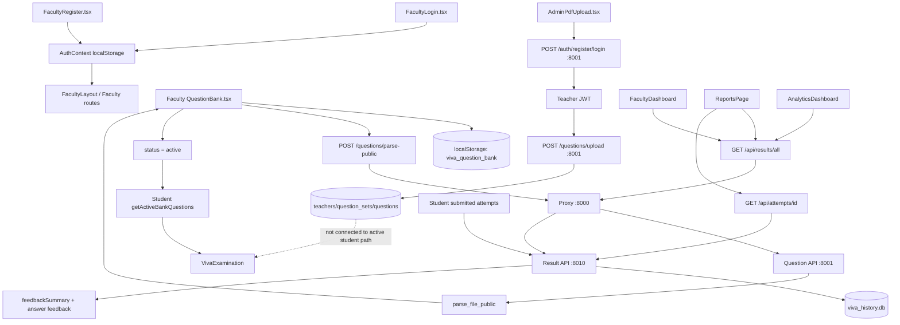

# Teacher / Faculty Workflow Analysis

**Analysis date:** 2026-09-12  
**Scope:** Source-verified trace of the teacher/faculty workflow from opening the faculty UI through question creation/import, saving, activation, student availability, attempt viewing, individual results, feedback, analytics, monitoring, and reports.  
**Source verification:** `PROJECT_ARCHITECTURE_REPORT.md` and `RUNTIME_FLOW_ANALYSIS.md` were read first, then the relevant frontend, proxy, Question API, result API, and storage source files were inspected directly.  
**Code changes:** None. This report is the only new file.

## Status Legend

- **REAL BACKEND:** A request reaches a backend handler and may write/read a server-side database.
- **LOCALSTORAGE:** Browser-only state; no backend persistence.
- **DEMO:** Hardcoded/sample data or a default UI value.
- **SIMULATED:** The UI presents behavior that is represented by local state, delays, or generated placeholder data rather than a complete backend operation.
- **FALLBACK:** Used when the preferred request/data is unavailable or absent.
- **DISCONNECTED:** Implemented code exists but is not connected to the normal faculty/student path.
- **BROKEN/MISMATCHED:** The source caller and the intended backend/data contract do not align.
- **CONFIRMED:** Directly verified from source.

## 1. Executive Finding

There is not one unified teacher workflow. The repository contains three different question-management paths:

1. **Normal Faculty Question Bank UI:** localStorage-backed question CRUD and activation. This is the path linked from the faculty portal and the path that students actually consume.
2. **Faculty file import:** real parsing through the Question API on port 8001, but the parsed questions are returned to the browser and then saved only to localStorage. The Question API does not persist them.
3. **Admin PDF upload:** a separate admin screen obtains a Question API JWT and calls the authenticated upload route. This is real backend/database persistence, but the resulting database question set is not synchronized into the faculty localStorage bank or the student viva path.

Faculty login and registration in the normal UI are localStorage simulations. The real teacher JWT authentication in the Question API is used by `AdminPdfUpload.tsx`, not by `FacultyLogin.tsx` or `FacultyRegister.tsx`.

Student availability is based on active localStorage questions grouped by subject. There is no backend publish/assignment operation. “Active” means the local question object has `status: "active"`; it is not a server-side publication state.

Viewing student attempts is the strongest real backend faculty workflow: the faculty dashboard, analytics, and reports call the result API on port 8010 through the proxy on port 8000. Individual report details are loaded from `/api/attempts/{id}` and read from `viva_history.db`. Result API access is not authenticated or role-restricted.

## 2. Faculty UI Entry and Login

### 2.1 Routes

**File:** `Viva_UI_Module-main/Viva_UI_Module-main/src/App.tsx`

The relevant routes are:

```text
/faculty/login      -> AuthLayout -> FacultyLogin
/faculty/register   -> AuthLayout -> FacultyRegister
/faculty/dashboard  -> FacultyLayout -> FacultyDashboard
/faculty/questions  -> FacultyLayout -> QuestionBank
/faculty/monitoring -> FacultyLayout -> LiveMonitoring
/faculty/analytics  -> FacultyLayout -> AnalyticsDashboard
/faculty/reports    -> FacultyLayout -> ReportsPage
```

`FacultyLayout` renders its sidebar, topbar, and nested route through `<Outlet />`.

**Important:** `App.tsx` does not show a route guard that requires an authenticated faculty user. A person can navigate directly to faculty routes. The layout reads the current `AuthContext` user but does not reject unauthenticated access.

**Classification:** CONFIRMED, LOCAL UI routing, UNPROTECTED.

### 2.2 Faculty login

**File:** `src/pages/faculty/FacultyLogin.tsx` -> `handleLogin(e)`.

The form collects:

- email;
- department;
- password.

The handler:

1. Rejects empty email/password/department locally.
2. Waits 800 ms using `setTimeout`.
3. Calls `login(email, "faculty")` from `useAuth()`.
4. Navigates to `/faculty/dashboard` if `login()` returns true.

It does **not** call:

```text
POST /auth/login
```

It does not contact port 8001, the proxy, or any database.

**File:** `src/contexts/AuthContext.tsx` -> `login(email, targetRole)`.

The function:

1. Reads `viva_users` from localStorage.
2. Searches for a matching email and role.
3. Does not compare the submitted password with anything.
4. If no user is found, creates a copy of `DEFAULT_FACULTY` with the submitted email.
5. Stores the user in:
   - `viva_session_faculty`;
   - `viva_session`.
6. Sets React state and returns `true`.

`DEFAULT_FACULTY` is a hardcoded user named `Dr. Mamali` with role `faculty`.

**Classification:** SIMULATED/LOCALSTORAGE. The screen looks like a login, but it is not backend authentication.

### 2.3 Faculty registration

**File:** `src/pages/faculty/FacultyRegister.tsx` -> `handleSubmit(e)`.

The form locally validates name, email, employee ID, department, designation, password length, and password confirmation. After a one-second artificial delay it calls:

```text
register(form, "faculty")
```

from `AuthContext`.

**File:** `src/contexts/AuthContext.tsx` -> `register(data, targetRole)`.

The function:

1. Reads `viva_users` from localStorage.
2. Checks duplicate email locally.
3. Constructs an `AuthUser` object.
4. Pushes it into the local users array.
5. Stores the array in `viva_users`.
6. Stores the active session in `viva_session_faculty` and `viva_session`.
7. Returns `{ success: true }`.

There is no call to Question API `/auth/register` from the normal Faculty registration page.

**Classification:** LOCALSTORAGE/SIMULATED. The success screen says an account is registered, but no server-side teacher record is created.

### 2.4 Real backend teacher authentication, separate from normal faculty login

**Files:**

- `ai_viva_question_module-main/ai_viva_question_module-main/main.py`
- `ai_viva_question_module-main/ai_viva_question_module-main/database.py`

The Question API defines real routes:

```text
POST /auth/register
POST /auth/login
POST /auth/token
GET  /auth/me
```

`/auth/register` writes a `Teacher` row after hashing the password with bcrypt. `/auth/login` verifies the email/password and returns a JWT. Protected Question API routes use `OAuth2PasswordBearer` and `get_current_teacher()`.

However, normal `FacultyLogin.tsx` and `FacultyRegister.tsx` do not call these routes. The real backend auth is used by the separate admin upload component described later.

**Classification:** REAL BACKEND functionality exists, but DISCONNECTED from the normal faculty login flow.

## 3. Opening the Faculty Dashboard

**File:** `src/pages/faculty/FacultyDashboard.tsx`.

On mount, its `useEffect` performs three operations:

1. Reads `viva_time_limit` from localStorage.
2. Reads the question count using `getBankQuestions()`.
3. Calls `fetchAllAttempts()` to load result summaries.

### 3.1 Question count

```text
FacultyDashboard
  -> getBankQuestions()
  -> localStorage key viva_question_bank
```

The displayed “Questions Bank” count is the localStorage bank count. It is not a count from the Question API database.

**Classification:** LOCALSTORAGE.

### 3.2 Faculty statistics

```text
FacultyDashboard
  -> fetchAllAttempts()
  -> GET /api/results/all at proxy :8000
  -> GET /api/results/all at result API :8010
  -> get_all_attempts()
  -> result_storage_module/viva_history.db
```

The result API returns summary fields including ID, student ID/name, subject, percentage, grade, and date. The dashboard calculates:

- unique student count;
- assessment count;
- average score.

The displayed active-session count is hardcoded to `0` in the JSX, not derived from `LiveMonitoring` or a backend endpoint. Pending reviews is also hardcoded to `0`.

**Classification:** REAL BACKEND for attempt statistics; DEMO/HARDCODED for active sessions and pending reviews.

### 3.3 Faculty exam time setting

`handleSaveTimeLimit()` converts the entered minutes to seconds and writes:

```text
localStorage key: viva_time_limit
```

Student `VivaExamination.tsx` later reads this key for the exam timer. There is no API call or database write.

**Classification:** LOCALSTORAGE. It affects students sharing the same browser storage context, not a backend exam configuration.

## 4. Normal Faculty Question Bank Workflow

**File:** `src/pages/faculty/QuestionBank.tsx`.

### 4.1 Initial load

The component initializes state with:

```text
useState<BankQuestion[]>(getBankQuestions)
```

The first `useEffect` runs:

```text
saveBankQuestions(questions)
```

whenever the React `questions` state changes.

**File:** `src/services/questionBank.ts`.

The storage key is:

```text
viva_question_bank
```

`getBankQuestions()` seeds five `INITIAL_BANK_QUESTIONS` when no valid bank exists. The initial questions are all active and have subjects, categories, expected answers, difficulty, language, time limit, creator, date, and `timesUsed`.

**Classification:** LOCALSTORAGE/DEMO defaults.

### 4.2 Creating a question

The UI's “Add Question” action calls `openCreate()`:

```text
setEditingQ(null)
setForm(defaultForm)
setShowDialog(true)
```

The form collects:

- question text;
- expected answer;
- subject;
- category/topic;
- difficulty;
- language;
- status (`active` or `draft`);
- time limit.

`handleSave()` first requires non-empty question and subject. For a new question it creates:

```text
id = Q-{Date.now()}
createdBy = user.name or "Faculty"
createdAt = current date
 timesUsed = 0
```

It prepends the new question to React state:

```text
setQuestions(qs => [newQ, ...qs])
```

The state-change effect immediately calls `saveBankQuestions(questions)`, which writes the full bank to localStorage.

**Backend/API:** None.

**Database:** None.

**Classification:** REAL UI behavior, LOCALSTORAGE persistence only.

### 4.3 Editing a question

`openEdit(q)` copies the selected question into the form. `handleSave()` maps the question list and replaces the matching object by ID:

```text
q.id === editingQ.id ? { ...q, ...form, ... } : q
```

The updated list is then persisted by `saveBankQuestions()` to `viva_question_bank`.

**Backend/API:** None.

**Classification:** LOCALSTORAGE.

### 4.4 Deleting a question

The delete confirmation calls:

```text
setQuestions(qs => qs.filter(q => q.id !== id))
```

The state-change effect writes the resulting list back to localStorage.

The UI says the question and expected answer are permanently removed from the bank, but “permanent” means browser localStorage only.

**Backend/API:** None.

**Classification:** LOCALSTORAGE.

## 5. Importing Questions from a File

### 5.1 Faculty Question Bank import path

**File:** `src/pages/faculty/QuestionBank.tsx` -> `handlePdfUpload()`.

The UI accepts:

```text
pdf, docx, xlsx, csv, pptx
```

It validates the extension locally, creates a `FormData` body containing `file`, `title`, and optional `subject`, and calls:

```text
POST http://127.0.0.1:8000/questions/parse-public
```

No Authorization header is sent.

### 5.2 Proxy routing

**File:** `proxy_server.py` -> `proxy(request, path)`.

The path `questions/parse-public` matches the Question API branch:

```text
path.startswith("questions")
```

The proxy forwards the request to:

```text
http://127.0.0.1:8001/questions/parse-public
```

**Port transition:** browser/UI `5173` -> proxy `8000` -> Question API `8001`.

### 5.3 Public parser backend

**File:** `ai_viva_question_module-main/ai_viva_question_module-main/main.py` -> `parse_file_public()`.

The endpoint is explicitly documented as public and unauthenticated. It:

1. Reads the uploaded file.
2. Rejects files larger than 5 MB.
3. Calls `parse_file(filename, contents)`.
4. Supports PDF, DOCX, XLSX/XLS, CSV, and PPTX.
5. Parses Q&A pairs through `_parse_text()` or `_parse_table()`.
6. Returns a JSON object containing title, subject, original filename, count, and question/answer pairs.
7. Does not create a `QuestionSet` or `Question` row.

The 10-15 question count check belongs to `_validate_count()`, which is called by the authenticated `/questions/upload` route, not by `parse_file_public()`.

**Classification:** REAL BACKEND parsing, but no database persistence; public/unauthenticated.

### 5.4 Import result saved locally

After the public parser responds, `QuestionBank.tsx` maps each returned pair into a `BankQuestion`:

```text
id = PDF-{Date.now()}-{index}
category = "From PDF"
difficulty = "Medium"
language = "English"
status = "active"
timeLimit = 120
createdBy = current faculty name or "Faculty"
```

It prepends those objects to React state. The state effect then calls `saveBankQuestions()`, writing them into:

```text
localStorage key: viva_question_bank
```

The success message says students will see them in their next viva. That statement is true only for students using the same browser storage context/profile, because no server-side publish/synchronization occurs.

**Classification:** REAL parser request + LOCALSTORAGE persistence. The Question API database remains unchanged.

### 5.5 Import failure behavior

The component displays a local error when:

- no file/title is selected;
- extension is unsupported;
- response is not JSON;
- response is non-2xx;
- parser returns no questions;
- Question API is unavailable.

Existing localStorage questions remain available; the import itself is not partially persisted by the backend.

## 6. Saving, Activating, and Publishing Questions

### 6.1 Status control

The Question Bank form includes:

```text
active -> "Active (shown to students)"
draft  -> "Draft (hidden)"
```

The status is stored as a property on each `BankQuestion` object. The list filters and badges by this property.

**File:** `src/services/questionBank.ts` -> `getActiveBankQuestions()`.

It returns:

```text
getBankQuestions().filter(q => q.status === "active")
```

### 6.2 What “publish” actually does

There is no function named publish, no publish endpoint, no exam-assignment endpoint, and no server-side status update.

Changing a question from draft to active through the form:

```text
QuestionBank form
  -> handleSave()
  -> React questions state
  -> saveBankQuestions()
  -> localStorage.viva_question_bank
```

A student becomes able to see the question only when their browser reads the same localStorage bank and the question has `status === "active"`.

**Classification:** LOCALSTORAGE activation. Not a real backend publication.

### 6.3 What is not implemented

- No Question API update route for individual question status.
- No persistent `published_at` or publication state in the Question API schema.
- No exam/session record linking a teacher, question set, subject, and student cohort.
- No server-side assignment or scheduling.
- No cross-browser propagation of faculty-created questions.
- No randomization or server-side versioning.

**Conclusion:** “Active/shown to students” is a frontend filtering convention, not a backend publishing workflow.

## 7. How Activated Questions Become Available to Students

### 7.1 Same-browser localStorage path

**File:** `src/pages/student/StudentDashboard.tsx` -> `getUpcomingSessionsFromBank()`.

The student dashboard reads the localStorage bank, filters active questions, and groups them by subject. Each group becomes an immediately available session with:

- generated `session-{index}` ID;
- display subject;
- raw subject;
- current date;
- “Available Now” time;
- summed question duration;
- question count.

When the student chooses a session, `startExam(session)` writes:

```text
selected_viva_subject = session.rawSubject
selected_viva_title = session.subject
```

and routes to `/student/instructions`.

### 7.2 Viva question loading

**File:** `src/pages/student/VivaExamination.tsx`.

`loadBankQuestions()` reads active localStorage questions, filters by `selected_viva_subject`, and maps them into the runtime `VivaQuestion` shape. The local question bank is used before the backend question API.

If the local bank has at least one active question, the mount effect returns without calling `fetchQuestions()`.

**Classification:** CONFIRMED localStorage path. This is the actual path for questions created/imported in the normal Faculty Question Bank, provided the student shares that browser storage context.

### 7.3 Cross-device behavior

A separate student browser/device has a different localStorage namespace and will not automatically receive faculty-created local questions. The Question API database is not queried by the normal student path for these faculty questions.

**Classification:** BROKEN for a multi-user/multi-device publishing model; functional only as a local demo or shared-browser scenario.

## 8. Separate Real Database Upload Path: Admin PDF Upload

This is not the normal faculty Question Bank workflow, but it is the repository’s real persistent Question API upload path.

**File:** `src/pages/admin/AdminPdfUpload.tsx`.

### 8.1 Backend registration/login

`getAuthToken()` calls through the proxy:

```text
POST /auth/register
POST /auth/login
```

The proxy routes both to port 8001.

The component attempts to register a teacher using the form's default credentials, ignores registration errors, then logs in and extracts `access_token`.

### 8.2 Authenticated upload

`handleUpload()` sends multipart form data to:

```text
POST /questions/upload
```

with:

```text
Authorization: Bearer <access_token>
```

The proxy forwards this to Question API port 8001.

### 8.3 Database write

**File:** Question API `main.py` -> `upload_file()`.

The endpoint:

1. Requires `get_current_teacher()`.
2. Reads the file and enforces a 5 MB maximum.
3. Parses it.
4. Enforces 10-15 Q&A pairs through `_validate_count()`.
5. Creates a `QuestionSet` with title, subject, filename, and `teacher_id`.
6. Adds one `Question` row per pair.
7. Commits the transaction.
8. Returns the question set with answers.

**Database models:** `database.py` defines:

```text
teachers
question_sets
questions
```

with relationships:

```text
Teacher 1 -> many QuestionSet 1 -> many Question
```

**Classification:** REAL backend authentication, REAL database persistence.

### 8.4 Why this does not publish to students

The normal student viva reads `viva_question_bank` from localStorage. It does not call:

```text
GET /questions/my-sets
GET /questions/set/{id}/viva
```

The admin upload component stores the API response only in its own React state (`uploadResult`). It does not merge the uploaded questions into `questionBank.ts` localStorage.

Therefore, this database-backed QuestionSet is not automatically available to students in the active browser viva.

**Classification:** REAL but DISCONNECTED from active student availability.

## 9. Faculty Attempt and Student List Workflow

### 9.1 Faculty dashboard attempt summary

**File:** `src/pages/faculty/FacultyDashboard.tsx` -> `fetchAllAttempts()`.

**Frontend client:** `src/services/api.ts`.

```text
fetchAllAttempts()
  -> GET /api/results/all
  -> API_BASE defaults to http://127.0.0.1:8000
```

**Proxy:** `proxy_server.py` routes `api/results/all` to:

```text
http://127.0.0.1:8010/api/results/all
```

**Result API:** `result_storage_module/server.py` -> `do_GET()` branch `path == "/api/results/all"` -> `get_all_attempts()`.

**Database:** `result_storage_module/viva_history.db`.

`get_all_attempts()` selects:

```sql
SELECT id, student_id, student_name, subject, percentage, grade, created_at
FROM viva_attempts
ORDER BY id DESC
```

It returns summary objects with:

```text
id, studentId, studentName, subject, percentage, grade, date
```

**Classification:** REAL backend/database read, but unauthenticated.

### 9.2 Faculty reports list

**File:** `src/pages/faculty/ReportsPage.tsx` -> `loadRealTimeAttempts()`.

On mount it calls `fetchAllAttempts()` using the same path:

```text
Browser :5173
  -> proxy :8000 /api/results/all
  -> result API :8010 /api/results/all
  -> get_all_attempts()
  -> viva_history.db
```

The page stores the returned summaries in React state and filters them locally by:

- student name;
- student ID/roll number;
- subject.

No additional database query is used for filtering.

The page labels the records “Live Database Records,” and that label is accurate for the initial list: the list comes from the result database. The data is not pushed live; it loads on mount and refreshes only when the user presses the refresh button.

**Classification:** REAL backend read with local UI filtering; not real-time streaming.

### 9.3 Faculty analytics

**File:** `src/pages/faculty/AnalyticsDashboard.tsx`.

It also calls `fetchAllAttempts()` and computes totals, averages, pass rate, top score, subject groups, score buckets, and attempt trends from the returned summaries.

However, when there are no attempts it inserts hardcoded preview data:

- default subject score groups;
- sample distribution counts;
- sample monthly trend;
- fallback displayed totals/averages/pass rate/top score.

The language chart is a hardcoded array regardless of database content:

```text
English (US/UK) 85
Hindi / Hinglish 10
Other Regional 5
```

**Classification:** REAL backend input when attempts exist; DEMO fallback/sample analytics when data is absent; language analytics are DEMO/static.

## 10. Viewing an Individual Student Attempt/Result

### 10.1 Selecting an attempt in Faculty Reports

**File:** `src/pages/faculty/ReportsPage.tsx` -> `handleViewIndividualReport(attemptId)`.

When the faculty clicks “View Report”:

```text
handleViewIndividualReport(attempt.id)
  -> fetchAttemptById(String(attemptId))
  -> GET /api/attempts/{attemptId} at proxy :8000
  -> GET /api/attempts/{attemptId} at result API :8010
```

### 10.2 Result API detail route

**File:** `result_storage_module/server.py` -> `VivaApiHandler.do_GET()`.

The route branch:

```text
path.startswith("/api/attempts/")
```

extracts the suffix, converts it to an integer, and calls:

```text
get_attempt_by_id(attempt_id)
```

`get_attempt_by_id` is an alias for `storage.get_attempt`.

**File:** `result_storage_module/storage.py` -> `get_attempt()`.

It reads:

```sql
SELECT * FROM viva_attempts WHERE id = ?
SELECT * FROM viva_answers WHERE attempt_id = ? ORDER BY question_id
```

It calls `format_attempt()` to construct the full result object.

**Database:** `result_storage_module/viva_history.db`.

### 10.3 What the faculty sees

The detail modal in `ReportsPage.tsx` displays:

- student name and ID;
- subject, date, duration;
- overall score and grade;
- five score metrics from `result.scores`;
- each question text;
- student answer/transcript;
- answer score;
- stored feedback.

The backend also returns `validation`, `strengths`, `missingPoints`, `category`, and expected answer, although the report modal does not display every returned field.

**Classification:** REAL backend/database read and real modal rendering of stored data.

### 10.4 Authorization status

The result API detail route does not require a token and does not verify the faculty identity. Any client that can reach port 8000/8010 can request an attempt ID.

**Classification:** REAL functionality with missing authorization.

## 11. Feedback Workflow

### 11.1 Where feedback is generated

**File:** `result_storage_module/storage.py` -> `build_feedback_summary(items)`.

During `format_attempt()`, the backend builds:

```text
strengths
improvements
recommendations
topicFeedback
```

from the saved answer-level fields.

For each answer, topic feedback contains:

```text
topic = category
score = answer score * 10
comment = answer feedback
```

Recommendations are generic:

- revise missing concepts and structure explanations clearly, when improvements exist;
- practice concise spoken explanations.

This feedback summary is stored in the returned formatted object, not as a separate feedback database table.

### 11.2 Faculty access to feedback

Faculty `ReportsPage.tsx` displays the stored answer-level `feedback` in the individual report modal. The UI does not call `/api/feedback/latest` for faculty reports.

The API client defines:

```text
fetchLatestFeedback()
  -> GET /api/feedback/latest
```

and the result API implements it by loading the globally latest attempt, but this is not the normal faculty report detail path.

**Classification:** REAL generated/read feedback for stored attempts; no separate feedback persistence.

### 11.3 Student feedback relationship

Students use `FeedbackPage.tsx`, which retrieves the selected attempt detail using the same `/api/attempts/{id}` endpoint and renders `result.feedbackSummary`. Faculty and student feedback are therefore views over the same result object.

There is no separate teacher comment entry or teacher feedback-edit API.

## 12. Reports and Export Workflow

### 12.1 Viewing reports

The “View Report” action is functional as described in Section 10: it calls the result detail API and shows the returned record.

### 12.2 Download individual report

**File:** `ReportsPage.tsx` -> `handleDownloadIndividualReport(attempt)`.

The function:

1. Sets a loading state.
2. Waits one second using `setTimeout`.
3. Builds a plain text string containing student, roll number, subject, date, percentage, and grade.
4. Creates a `Blob` with MIME type `text/plain`.
5. Creates a browser object URL.
6. Triggers a download named:

```text
VivaReport_<studentId>_<subject>.txt
```

The button/modal label says “Download PDF Report,” but the actual file is a text file.

**Classification:** SIMULATED export. No report endpoint, PDF generator, XLSX generator, or server-side file is involved.

### 12.3 Generate custom report

**File:** `ReportsPage.tsx` -> `handleGenerateCustomReport()`.

The function:

1. Requires a title.
2. Waits 1.5 seconds.
3. Creates a new in-memory object with fixed values:
   - percentage `85`;
   - grade `A`;
   - generated student/batch labels.
4. Prepends it to the local `attempts` React state.
5. Closes the dialog and resets the form.

It does not call an API, write a database row, create a file, or use the selected PDF/XLSX format.

**Classification:** SIMULATED/DEMO. The generated record disappears on reload.

## 13. Live Monitoring and Proctor Flags

### 13.1 Faculty monitoring source

**File:** `src/pages/faculty/LiveMonitoring.tsx` -> `loadLiveSessions()`.

Every 1.5 seconds, it reads:

```text
localStorage key: viva_active_session
```

It displays the session only if `Date.now() - lastUpdated < 300000`.

It does not call the proxy, result API, Question API, WebSocket, or a monitoring database.

**Classification:** LOCALSTORAGE polling, not backend live monitoring.

### 13.2 Student-to-faculty data

The student `VivaExamination.tsx` writes `viva_active_session` every second. Data includes current question, status, transcript, elapsed time, and a computed display score. The camera stream itself is not placed in localStorage or sent to faculty.

### 13.3 Flagging

Faculty flag actions write:

```text
viva_flagged_sessions
viva_suspicious_flag
```

The student viva reads `viva_suspicious_flag` every 1.5 seconds and displays a warning if it is recent.

**Classification:** LOCALSTORAGE/SIMULATED cross-page alert. It only works where pages share the same browser storage origin/profile. It is not a secure proctoring event.

## 14. Real Backend vs Local/Demo Classification Table

| Workflow stage | Exact implementation | Classification |
|---|---|---|
| Open `/faculty/login` | React Router + `AuthLayout` | REAL UI route |
| Faculty login | `FacultyLogin` -> `AuthContext.login` | LOCALSTORAGE/SIMULATED |
| Faculty registration | `FacultyRegister` -> `AuthContext.register` | LOCALSTORAGE/SIMULATED |
| Direct faculty route access | `App.tsx` routes + `FacultyLayout` | UNPROTECTED |
| Load question bank | `getBankQuestions` | LOCALSTORAGE |
| Add/edit/delete question | `QuestionBank.handleSave/handleDelete` | LOCALSTORAGE |
| Set active/draft | `BankQuestion.status` + `saveBankQuestions` | LOCALSTORAGE activation |
| Parse faculty file | `QuestionBank.handlePdfUpload` -> `/questions/parse-public` | REAL parser backend, no DB write |
| Save parsed faculty file questions | React state -> `saveBankQuestions` | LOCALSTORAGE |
| Authenticated question upload | `AdminPdfUpload` -> `/questions/upload` | REAL JWT + database, ADMIN path |
| Student availability of faculty questions | `getUpcomingSessionsFromBank` | LOCALSTORAGE only |
| Question API question-set read for student | No confirmed call from active student path | DISCONNECTED |
| Dashboard attempt summaries | `fetchAllAttempts` -> `/api/results/all` | REAL result DB read |
| Analytics with attempts | `AnalyticsDashboard` computations | REAL DB input + local calculations |
| Analytics with no attempts | Hardcoded sample groups/trends | DEMO/FALLBACK |
| View individual attempt | `fetchAttemptById` -> `/api/attempts/{id}` | REAL result DB read |
| View feedback | `format_attempt`/`build_feedback_summary` | REAL generated response from stored records |
| Download report | Browser text Blob | SIMULATED, not PDF |
| Generate custom report | Fixed in-memory React object | SIMULATED, not persisted |
| Live monitoring | `viva_active_session` localStorage | LOCALSTORAGE/SIMULATED |
| Proctor flags | `viva_suspicious_flag` localStorage | LOCALSTORAGE/SIMULATED |

## 15. Exact API and Database Map

### 15.1 Faculty-facing request map

| Action | Frontend function/file | Endpoint | Port sequence | Backend function | Persistence |
|---|---|---|---|---|---|
| Import/parse file | `QuestionBank.handlePdfUpload` | `POST /questions/parse-public` | 5173 -> 8000 -> 8001 | `parse_file_public()` | None in Question DB; result returned to browser |
| Load all attempt summaries | `FacultyDashboard`, `ReportsPage`, `AnalyticsDashboard` -> `fetchAllAttempts` | `GET /api/results/all` | 5173 -> 8000 -> 8010 | `get_all_attempts()` | Reads `viva_history.db.viva_attempts` |
| Load one attempt | `ReportsPage.handleViewIndividualReport` -> `fetchAttemptById` | `GET /api/attempts/{id}` | 5173 -> 8000 -> 8010 | `get_attempt()` / `format_attempt()` | Reads `viva_attempts` + `viva_answers` |
| Latest feedback helper | `fetchLatestFeedback` | `GET /api/feedback/latest` | 5173 -> 8000 -> 8010 | `get_latest_attempt()` | Reads latest attempt; not normal faculty path |
| Backend persistent upload | `AdminPdfUpload.handleUpload` | `POST /questions/upload` | 5173 -> 8000 -> 8001 | `upload_file()` | Writes Question API DB |
| Backend teacher login | `AdminPdfUpload.getAuthToken` | `POST /auth/login` | 5173 -> 8000 -> 8001 | `login()` | Reads `teachers`; returns JWT |

### 15.2 Databases/storage

| Storage | Tables/keys | Faculty role |
|---|---|---|
| Browser localStorage | `viva_users`, sessions, `viva_question_bank`, time limit, monitoring flags | Main faculty auth/question/publish state |
| Question API database | `teachers`, `question_sets`, `questions` | Real backend upload path only; not normal faculty bank source |
| Result database | `viva_attempts`, `viva_answers` in `result_storage_module/viva_history.db` | Real source for attempts/results/reports |
| Speech database | `viva_questions` in `viva.db` | DISCONNECTED from faculty UI |
| Standalone evaluation DB | `evaluation_results` | DISCONNECTED from faculty UI |

## 16. End-to-End Normal Faculty Flow

```text
1. Open http://127.0.0.1:5173/faculty/login
   -> Vite UI on port 5173
   -> React Router renders FacultyLogin

2. Submit faculty login form
   -> FacultyLogin.handleLogin()
   -> AuthContext.login(email, "faculty")
   -> localStorage viva_users/session keys
   -> navigate /faculty/dashboard
   -> no backend authentication

3. Open Faculty Question Bank
   -> App route /faculty/questions
   -> FacultyLayout -> QuestionBank
   -> getBankQuestions()
   -> localStorage viva_question_bank

4. Create/edit/delete a question
   -> QuestionBank.handleSave()/handleDelete()
   -> React questions state
   -> saveBankQuestions()
   -> localStorage viva_question_bank
   -> no Question API/database write

5. Activate/publish a question
   -> set form status to active
   -> saveBankQuestions()
   -> localStorage only
   -> no publish endpoint or exam assignment

6. Optional file import
   -> QuestionBank.handlePdfUpload()
   -> POST :8000/questions/parse-public
   -> proxy -> Question API :8001
   -> parse_file_public()
   -> parser returns Q&A JSON
   -> frontend maps Q&A to active BankQuestion objects
   -> localStorage viva_question_bank

7. Student availability
   -> StudentDashboard.getUpcomingSessionsFromBank()
   -> filters status == active
   -> groups by subject
   -> student selects session
   -> localStorage selected_viva_subject/title
   -> VivaExamination reads active local bank questions

8. Student submits viva
   -> Result API stores attempt in viva_history.db

9. Faculty dashboard/reports/analytics
   -> fetchAllAttempts()
   -> GET :8000/api/results/all
   -> proxy -> :8010
   -> get_all_attempts()
   -> reads viva_attempts

10. Faculty opens one report
    -> ReportsPage.handleViewIndividualReport(id)
    -> GET :8000/api/attempts/id
    -> proxy -> :8010
    -> get_attempt()
    -> reads viva_attempts and viva_answers
    -> displays student answers, scores, feedback

11. Faculty downloads/generates report
    -> downloads a text Blob or inserts a fake React-state record
    -> no PDF/XLSX backend report exists
```

## 17. Separate Admin Database Flow

```text
AdminPdfUpload
  -> POST /auth/register :8001 through proxy
  -> POST /auth/login :8001 through proxy
  -> receive JWT
  -> POST /questions/upload :8001 with Bearer token
  -> Question API get_current_teacher()
  -> parse and validate 10-15 Q&A pairs
  -> INSERT question_sets
  -> INSERT questions
  -> return QuestionSetDetailWithAnswers
  -> store response only in admin component state
  -> no localStorage bank synchronization
  -> no active student-viva availability
```

This is the only inspected UI path that performs real persistent question-set creation in the Question API database.

## 18. Disconnected, Simulated, Fallback, and Broken Findings

| Finding | Classification | Source evidence | Consequence |
|---|---|---|---|
| Faculty login appears real but is not backend auth | SIMULATED/LOCALSTORAGE | `FacultyLogin` calls `AuthContext.login`; `login` accepts fallback user and ignores password | Any user can enter the faculty portal |
| Faculty registration appears server-backed but is local | SIMULATED/LOCALSTORAGE | `FacultyRegister` calls `AuthContext.register`; no fetch | No persistent teacher account is created |
| Normal Question Bank is not Question API-backed | DISCONNECTED | `QuestionBank` uses `getBankQuestions/saveBankQuestions`; no `/questions/my-sets` calls | Browser-local question bank is separate from SQL database |
| Faculty parser backend is real but non-persistent | REAL PARSER + LOCALSTORAGE | `/questions/parse-public` returns pairs; frontend saves them locally | Parsed questions do not become shared database questions |
| Active/draft is called publishing in UI language | LOCALSTORAGE ONLY | `status` filters `getActiveBankQuestions`; no publish route | No server-side publication or assignment exists |
| Admin upload is real but disconnected | REAL BACKEND + DISCONNECTED | `AdminPdfUpload` calls authenticated `/questions/upload`; student path reads localStorage | DB question sets are not shown to students automatically |
| Student access is same-browser dependent | BROKEN for distributed system | student sessions derive from localStorage bank | Faculty changes do not reach another browser/device |
| Faculty result list is real database data | REAL BACKEND | `/api/results/all` -> `get_all_attempts` | Summary view works if result API/database is available |
| Faculty result detail is real database data | REAL BACKEND | `/api/attempts/{id}` -> `get_attempt` | Individual answer/result display works if ID exists |
| Result access is unauthenticated | SECURITY GAP | result API handlers have no token dependency | Any caller can request attempt summaries/details |
| Feedback is generated in result formatting | REAL RESPONSE GENERATION | `format_attempt` -> `build_feedback_summary` | No separate feedback record/table |
| Download PDF is not PDF | SIMULATED/BROKEN LABEL | `Blob(..., {type:"text/plain"})`, `.txt` filename | User receives plain text, not PDF |
| Custom report generation is not persisted | SIMULATED | fixed object appended to React state | Generated report disappears on reload |
| Analytics no-data view uses samples | DEMO/FALLBACK | hardcoded subject/distribution/trend defaults | Empty database can look populated |
| Live monitoring is not server monitoring | LOCALSTORAGE/SIMULATED | `viva_active_session` polling | Does not work securely across devices |
| Speech/evaluation modules are not faculty workflow dependencies | DISCONNECTED | launcher does not start speech CLI; no faculty calls | Their databases do not power faculty reports |

## 19. What Is Actually “Published”?

The source code supports only this definition:

```text
A question is “published” when its localStorage BankQuestion.status equals "active" and a student in the same browser storage context reads it through getActiveBankQuestions().
```

The source code does **not** support this stronger definition:

```text
A teacher publishes a question set to a backend, assigns it to students, and students on other devices retrieve the same version.
```

That stronger workflow would require a server-side publication/assignment route and a student Question API read path, neither of which is connected in the inspected faculty/student UI.

## 20. Verified Answers to the Requested Questions

### How does a teacher enter the system?

Through `/faculty/login`, but normal login is localStorage/default-user logic. The Question API has real teacher JWT login, but normal FacultyLogin does not use it.

### Can a teacher create questions?

Yes, through `QuestionBank.tsx`, but the questions are saved only to browser localStorage.

### Can a teacher edit/delete questions?

Yes, through local React state followed by `saveBankQuestions()`. There is no normal backend CRUD path.

### Can a teacher import questions?

Yes. Faculty Question Bank calls the real public parser endpoint on port 8001 through the proxy, then saves the parsed results locally. Admin upload calls the authenticated persistent upload endpoint and writes the Question API database.

### Can a teacher publish/activate questions?

Only locally by selecting `active` status. There is no backend publication or assignment mechanism.

### How do questions reach students?

Normal faculty questions reach students through shared/local browser localStorage. The student dashboard groups active local questions by subject, and the viva page reads them. Backend Question API sets do not automatically reach students.

### Can faculty view student attempts?

Yes, through `/api/results/all` on the result API. The list is a real database read from `viva_history.db`, but it is unauthenticated.

### Can faculty view an individual result?

Yes, through `/api/attempts/{attemptId}`. The result API reads `viva_attempts` and `viva_answers` and returns the formatted attempt.

### Can faculty view feedback?

Yes, stored answer-level feedback and the generated `feedbackSummary` are returned with the full attempt and displayed in the report modal. There is no teacher feedback-edit workflow.

### Can faculty download a real report?

No. The download action creates a plain text `.txt` file. The custom report action creates a fixed, in-memory demo object and does not create a file or database record.

### Does faculty live monitoring use a backend?

No. It reads/writes localStorage keys and only works within the same browser storage context.

## 21. Final Architecture Diagram



## 22. Final Conclusion

The normal faculty experience is a local demo workflow:

```text
local faculty login
  -> local question creation/import
  -> local active/draft status
  -> local student availability
```

The faculty result experience is connected to a real backend:

```text
faculty dashboard/reports/analytics
  -> proxy :8000
  -> result API :8010
  -> viva_history.db
```

The Question API provides real teacher authentication and persistent question-set storage, but that path is currently used by the admin upload screen rather than the normal faculty Question Bank, and its stored question sets are not consumed by the active student viva.

Therefore:

- **Real backend/database:** result viewing, attempt summaries, individual attempt detail, Question API authenticated upload.
- **LocalStorage:** normal faculty login, registration, question CRUD, active/draft state, exam time setting, student question availability, live monitoring flags.
- **Simulated/demo:** login fallback, active-session dashboard count, report download, custom reports, empty-state analytics, language analytics.
- **Fallback:** default questions, default faculty user, sample analytics, local UI behavior after backend failures.
- **Disconnected:** Python speech module, standalone OpenAI evaluator, Question API database sets from the active student flow.
- **Broken/mismatched:** normal faculty publishing across devices, real PDF/XLSX report generation, route protection, and any assumption that backend-uploaded question sets automatically become student viva questions.
