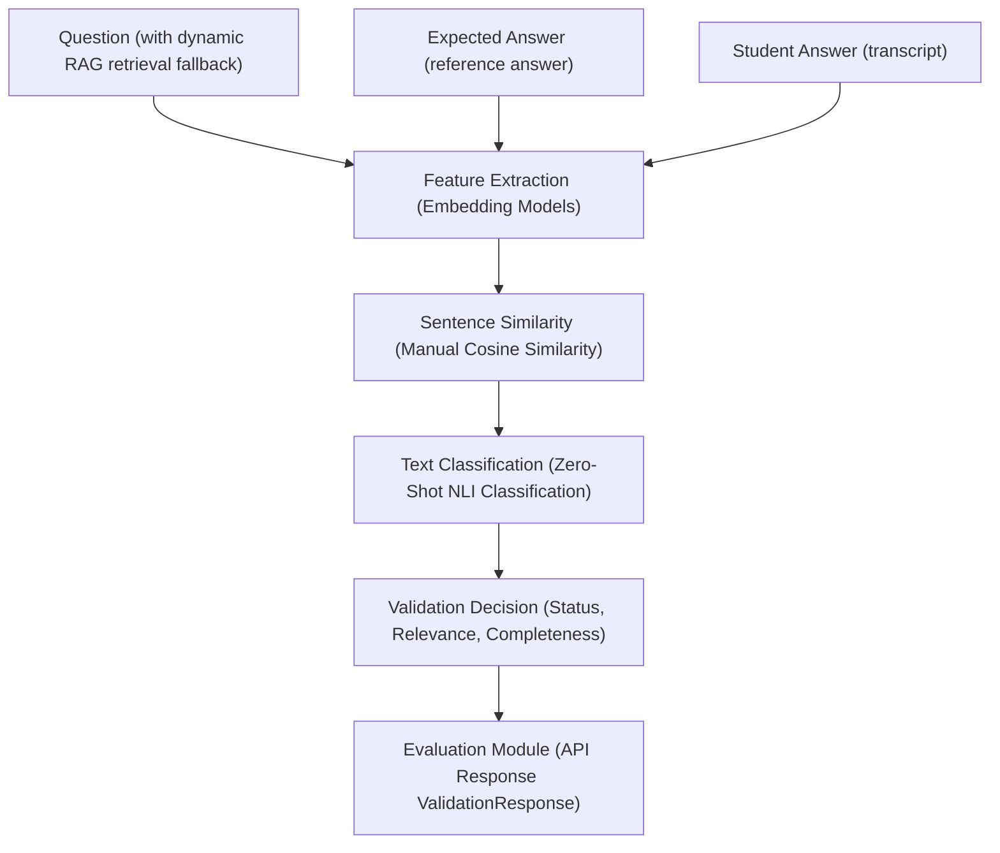

# AI Viva Validation Module

The **Validation Module** is a core component of the **AI-Based Viva System – Indian Language Understanding** developed for the SN Bose Summer Internship at NIT Silchar.

It acts as the semantic validation gateway between the **Speech Module** (which transcribes oral responses) and the **Evaluation Module** (which grades responses). It verifies that speech transcripts are valid attempts (filtering ASR noise, disfluencies, loops, stuttering, and off-topic responses) and calculates semantic similarity against reference answers.

---

## 📐 System Pipeline Architecture

The pipeline processes user inputs, performs semantic checks, classifications, and routes validation results back to the evaluation engine:



---

## ✨ Key Features

- **ASR Transcript Cleaning**: Strips punctuation, padding, and repeating disfluencies while keeping contractions intact.
- **Indian Language Support**: Preserves vowel matras and modifiers (combining characters) in Devanagari/Indian language scripts (e.g. Hindi, Bengali, Tamil) leveraging Unicode-aware pattern matching.
- **Stopword & Filler Filtering**: Filters multi-word filler disfluencies (e.g., *मतलब*, *यानी*, *है ना*, *you know*, *like*, *um*) natively in multiple scripts before similarity computation.
- **ASR Quality Guardrails**: Flags empty, stutter-filled, repeating, or gibberish inputs as `Invalid` immediately to bypass redundant CPU/GPU embedding processing.
- **Dynamic Concept Completeness**: Extracts reference answer concepts and uses token fuzzy keyword matching (`RapidFuzz`) to grade lists/arbitrary viva answers (Complete, Partially Complete, Irrelevant) dynamically.
- **Dynamic RAG Integration**: Automatically fetches reference answers from an extensible curriculum database if no reference answer is provided by the client caller.
- **Python 3.13 TorchScript JIT Workaround**: Dynamically mocks TorchScript JIT at import time to prevent AST crash loops in Hugging Face models under Python 3.13.

---

## 🤖 Configured Models

The module is powered by modern pre-trained models:

| Task | Model ID | Loading Library / Wrapper | Function |
| :--- | :--- | :--- | :--- |
| **Feature Extraction & Similarity (Default)** | `nvidia/llama-nemotron-embed-1b-v2` | `AutoModel` (Manual PyTorch Mean Pooling) | Text embedding extraction for English and Default contexts. |
| **Feature Extraction & Similarity (Indic)** | `sentence-transformers/paraphrase-multilingual-MiniLM-L12-v2` | `AutoModel` (Manual PyTorch Mean Pooling) | Text embedding extraction for Indian language contexts (Hindi, Bengali, Tamil). |
| **Zero-Shot Classification (NLI)** | `MoritzLaurer/mDeBERTa-v3-base-xnli-multilingual-nli-2mil7` | `AutoModelForSequenceClassification` | Performs sequence entailment to validate answer relevance. |
| **Question Answering (QA)** | `DragonLLM/Llama-Open-Finance-8B` | `AutoModelForCausalLM` | Optional high-fidelity local LLM QA validation. |
| **Text Generation (Feedback)** | `nvidia/Nemotron-Labs-Audex-30B-A3B` | `AutoModelForCausalLM` | Generates qualitative tutor remarks dynamically. |
| **Translation (Indic-to-English)** | `ai4bharat/indictrans2-indic-en-1B` | `AutoModelForSeq2SeqLM` | Multi-language translation support on the fly. |

---

## 📂 Project Structure

```text
validation-module/
│
├── app/
│   ├── api/
│   │   ├── v1/
│   │   │   ├── __init__.py
│   │   │   └── validation.py         # HTTP validation route endpoints
│   │   └── __init__.py
│   │
│   ├── services/
│   │   ├── __init__.py
│   │   ├── validation_service.py   # Core NLP inference singleton service
│   │   └── rag_service.py          # Dynamic RAG reference answer retrieval service
│   │
│   ├── schemas/
│   │   ├── __init__.py
│   │   └── validation.py           # Pydantic schema schemas
│   │
│   ├── utils/
│   │   ├── __init__.py
│   │   ├── exceptions.py           # Core domain validation exceptions
│   │   └── text_processor.py       # Matra preservation and filler word utils
│   │
│   ├── config/
│   │   ├── __init__.py
│   │   └── config.py               # Pydantic Settings settings manager
│   │
│   └── main.py                     # FastAPI server entrypoint
│
├── tests/
│   ├── __init__.py
│   ├── test_api.py                 # Endpoint routing integration tests
│   ├── test_text_processor.py      # Cleaner and matra extraction unit tests
│   ├── test_validation_service.py  # NLP scoring pipeline unit tests
│   └── test_model_features.py      # Feature Extraction, NLI, QA, feedback, translation, and RAG integration tests
│
├── .env                            # Environment configuration file
├── requirements.txt                # Required library packages
└── README.md                       # Documentation (This file)
```

---

## 🛠️ Installation & Server Startup

### 1. Create a Virtual Environment & Install Dependencies
Ensure you have Python 3.12+ installed:
```bash
python -m venv .venv
# Activate virtual environment:
# Windows (PowerShell): .venv\Scripts\Activate.ps1
# macOS/Linux: source .venv/bin/activate

pip install -r requirements.txt
```

### 2. Configure Environment Settings
Create a `.env` file in the root directory:
```ini
APP_NAME="AI Viva Validation Module"
APP_ENV="dev"
PORT=8000
HOST="0.0.0.0"

# Model Configurations
MODEL_NAME="nvidia/llama-nemotron-embed-1b-v2"
MULTILINGUAL_MODEL_NAME="sentence-transformers/paraphrase-multilingual-MiniLM-L12-v2"
CLASSIFICATION_MODEL_NAME="MoritzLaurer/mDeBERTa-v3-base-xnli-multilingual-nli-2mil7"
QA_MODEL_NAME="DragonLLM/Llama-Open-Finance-8B"
FEEDBACK_MODEL_NAME="nvidia/Nemotron-Labs-Audex-30B-A3B"
TRANSLATION_MODEL_NAME="ai4bharat/indictrans2-indic-en-1B"

# Optional Gemini API fallback (used if use_llm=True is sent)
GEMINI_API_KEY="YOUR_GEMINI_API_KEY"
```

### 3. Run the API Server
```bash
uvicorn app.main:app --reload --port 8000
```
Interactive docs are served at:
- **Swagger UI**: [http://localhost:8000/docs](http://localhost:8000/docs)
- **ReDocs**: [http://localhost:8000/redoc](http://localhost:8000/redoc)

---

## 📡 API Endpoints Spec

### 1. Health Status
- **URL**: `/health`
- **Method**: `GET`
- **Response**:
  ```json
  {
    "status": "healthy",
    "nlp_model": "nvidia/llama-nemotron-embed-1b-v2",
    "thresholds": {
      "min_similarity": 0.5,
      "min_relevance": 0.4
    }
  }
  ```

### 2. Post-ASR Answer Validation
- **URL**: `/api/v1/validate`
- **Method**: `POST`
- **Request Body Payload**:
  ```json
  {
    "question": "What is an operating system and what does it do?",
    "expected_answer": "An operating system is software that acts as an interface between computer hardware and the user.",
    "student_answer": "An operating system is the software that manages hardware resources and connects the user.",
    "language": "English",
    "speech_metadata": {
      "use_local_llm": false,
      "generate_feedback": false,
      "translate_input": false
    }
  }
  ```
- **Response Payload**:
  ```json
  {
    "validation_status": "Valid",
    "relevance_score": 0.82,
    "semantic_similarity": 0.88,
    "completeness": "Complete",
    "confidence": 0.86,
    "remarks": "Answer is relevant and semantically correct. Concept coverage: 100%."
  }
  ```

---

## 🧪 Verification & Testing

Run the automated test suite verifying all modules:
```bash
python -m pytest -v
```

All 25 tests verify embedding calculations, NLI validations, translation mappings, feedback loops, Matra safety checks, and full API endpoint routing.
